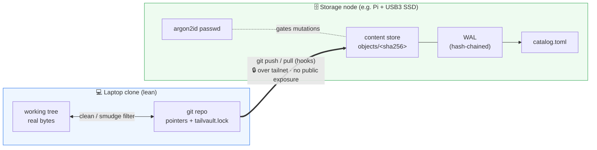
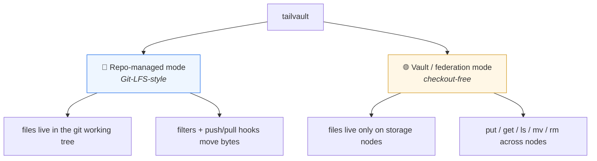
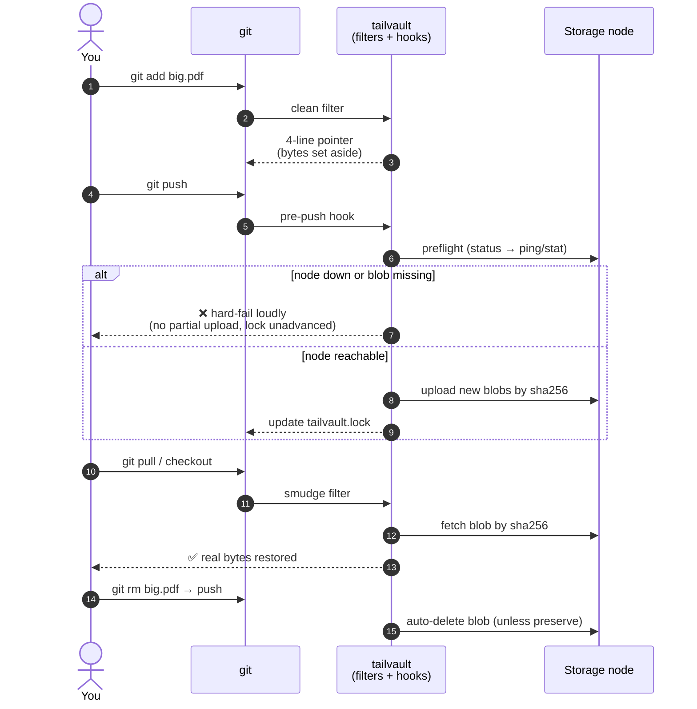
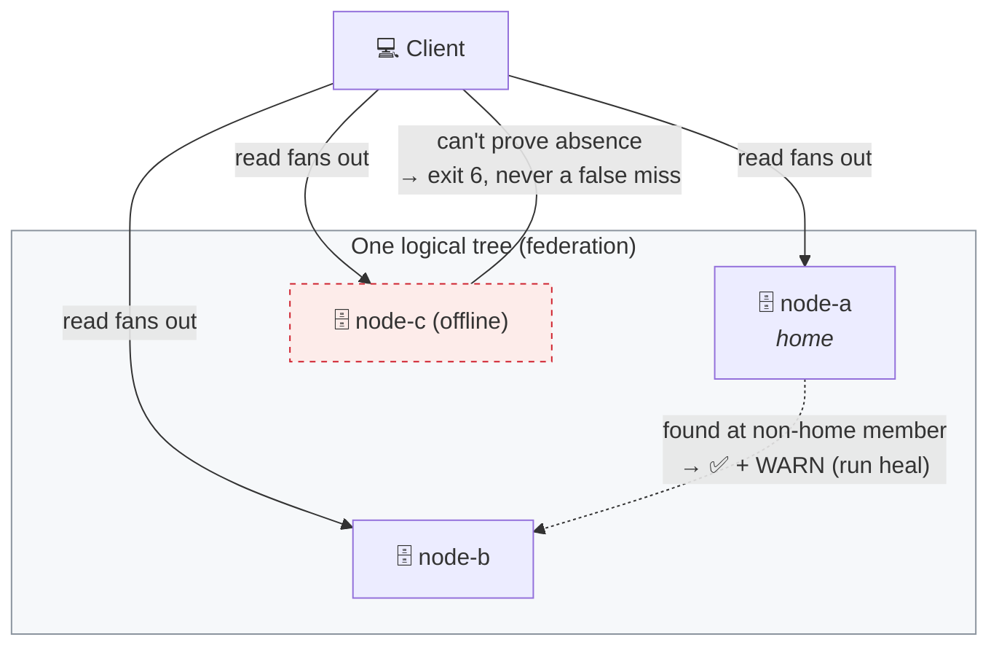

# Tailvault


**A Tailscale-native, content-addressed large-file store that syncs with
`git push` / `git pull`.**

`tailvault` keeps large binary files **out of git history** while keeping them in
lockstep with your normal git workflow. The real bytes live in a content-addressed
folder on a **Tailscale node** (e.g. a home Raspberry Pi with a USB3 SSD); the git
repo carries only small **pointer files** and a committed **lock file**. It is a
clean, bloat-averse alternative to Git LFS — **not a wrapper** — built on
git-native filters and hooks.

The headline guarantees:

- **History is off by default** (one current ref per file) to prevent repo bloat —
  but diffs and deletes are still tracked, and history is opt-in per file.
- **Deletes propagate.** A file removed from git is auto-deleted from storage
  unless you mark it `preserve`.
- **No silent success.** Every command that needs the node runs a preflight and
  **hard-fails loudly** if the node is down or an expected blob is missing — a
  green `git push` means the bytes actually landed on storage.

> **Status — v0.0.111, under active phased development.** The CLI is implemented
> and test-covered through Blocks 0–4 (core workflow + multi-node federation), and
> tagged releases ship prebuilt, checksummed binaries via Homebrew, a shell
> installer, `go install`, and `tailvault update`. Design is frozen in
> [`SPEC.md`](./SPEC.md). Personal project, pre-1.0 — installable, no stability
> commitment yet.

---

## How it works at a glance

Your laptop clone stays lean: git holds only tiny **pointer files** + a committed
**`tailvault.lock`**. The real bytes live content-addressed on a Tailscale
**storage node**, reached over your tailnet — no cloud, no public exposure, no
API keys. Clean/smudge **filters** swap bytes ⇄ pointers in the working tree;
git **hooks** move the real bytes on `push` / `pull`.



### Two modes



### Data flow — repo-managed mode



A **green `git push` means the bytes actually landed** — there is no silent
success. Identity is content-independent: a file's **ID** is the `sha256` of its
genesis record, so **moves change the path, never the ID**, and every clone's
lock is an off-node identity backup.

### Federation



Reads are **reachability-aware**: a genuinely missing file is exit `5`, but an
unprovable absence behind an offline member is exit `6` — never a false miss.
Destructive all-member ops (`gc`) **refuse** to run while any member is offline.

---

## Install

**Homebrew is the recommended path** — pick **one** channel; they all resolve to
the same signed, checksummed GitHub Release, so install and update are the same
action. **This repo is private**, so installs need GitHub auth (`gh auth login`,
or a read-only token).

```sh
export HOMEBREW_GITHUB_API_TOKEN=$(gh auth token)   # private-repo auth; omit when public
brew install Ibtesam-Mahmood/tap/tailvault
tailvault --version
```

Update with `brew upgrade tailvault`; uninstall with `brew uninstall tailvault`.

<details>
<summary><b>Prefer not to use Homebrew?</b> You only need one of these instead.</summary>

```sh
# shell installer (servers / CI / no Homebrew)
GITHUB_TOKEN=$(gh auth token) sh -c "$(curl -fsSL https://raw.githubusercontent.com/Ibtesam-Mahmood/tailvault/main/install.sh)"

# go install (Go devs)
go env -w GOPRIVATE=github.com/Ibtesam-Mahmood/*
go install github.com/Ibtesam-Mahmood/tailvault/cmd/tailvault@latest
```

Then `tailvault update` self-updates; `tailvault update --uninstall` removes it.
</details>

📖 **Full install, update, uninstall, requirements, and how to share with others
(grant access + auth) → [`docs/install.md`](./docs/install.md).**

---

## Quick start (repo-managed mode)

```sh
tailvault setup                  # create a local storage location (or: setup --remote for a node)
tailvault init                   # write tailvault.toml + .gitattributes + hooks
tailvault track "**/*.pdf"       # track large files by rule or path
git add . && git commit -m "add big assets"
git push                         # preflight + upload blobs + update lock
tailvault status                 # local-only / pushed / drifted / orphaned
```

📖 **Vault/federation quick start and the full command reference →
[`docs/commands.md`](./docs/commands.md).**

---

## Documentation

| Doc | What it is |
| --- | --- |
| [`docs/how-it-works.md`](./docs/how-it-works.md) | The two modes, moving parts, data flow, identity, federation, features, use cases. |
| [`docs/install.md`](./docs/install.md) | Install / update / uninstall / **share**, all channels, requirements. |
| [`docs/commands.md`](./docs/commands.md) | Quick starts + full command reference. |
| [`docs/configuration.md`](./docs/configuration.md) | `tailvault.toml` + `locations.toml` + state dirs. |
| [`docs/troubleshooting.md`](./docs/troubleshooting.md) | Error/exit codes + caveats & known issues. |
| [`docs/distribution.md`](./docs/distribution.md) | Release pipeline + maintainer setup (private). |
| [`docs/public-release.md`](./docs/public-release.md) | The go-public runbook. |
| [`SPEC.md`](./SPEC.md) | **Normative frozen contract** — file schemas, federation formats, error catalogue. |
| [`DESIGN.md`](./DESIGN.md) | Authoritative design dump: schemas, retention model, rejected options. |
| [`proposal.md`](./proposal.md) | Formal proposal: problem, architecture, phased plan. |
| [`CONTRIBUTING.md`](./CONTRIBUTING.md) | Workflow: versioning, task/issue tracking, PR conventions. |
| [`CHANGELOG.md`](./CHANGELOG.md) | Version history (`VERSION` is the single source of truth). |
| [`tasks/`](./tasks/) | Phased implementation backlog (mirrors GitHub issues). |

---

## Requirements (in brief)

**Tailscale** (logged in, daemon running, local session only) on the client and a
**storage node** with the **SSH backend** + a writable `base_path` on a real disk;
**git** for repo-managed mode; **Go 1.26+** only to build from source. Full detail
in [`docs/install.md`](./docs/install.md#requirements).

---

## Contributing

Work is tracked as GitHub issues **and** mirrored in [`tasks/`](./tasks/), in
**blocks of PRs**: one task ≈ one branch (`phase-N/<slug>`) ≈ one PR that
`Closes #N`, bumps [`VERSION`](./VERSION) by `+0.0.1`, and adds a matching
`## v<version>` entry to [`CHANGELOG.md`](./CHANGELOG.md) in the same commit.
`main` stays green.

```sh
make build       # build with embedded version → bin/tailvault
make test        # go test ./...
make vet         # go vet ./...
make fmt         # gofmt -l .
```

See [`CONTRIBUTING.md`](./CONTRIBUTING.md) and [`CLAUDE.md`](./CLAUDE.md) for the
full workflow and locked decisions.
