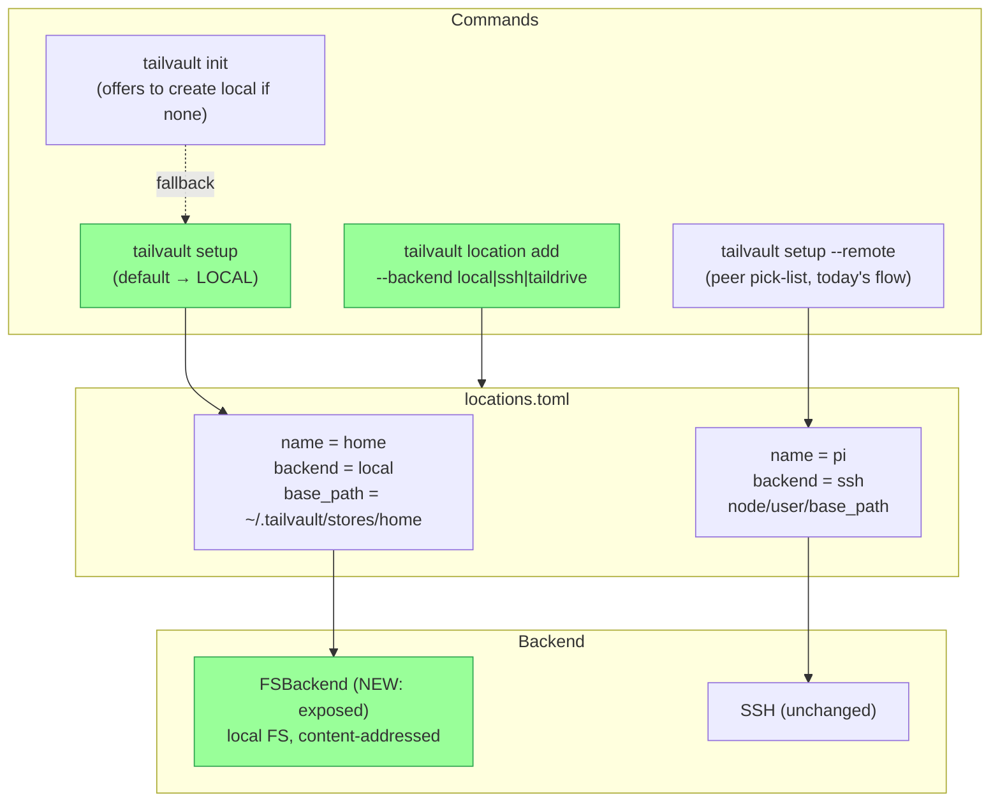
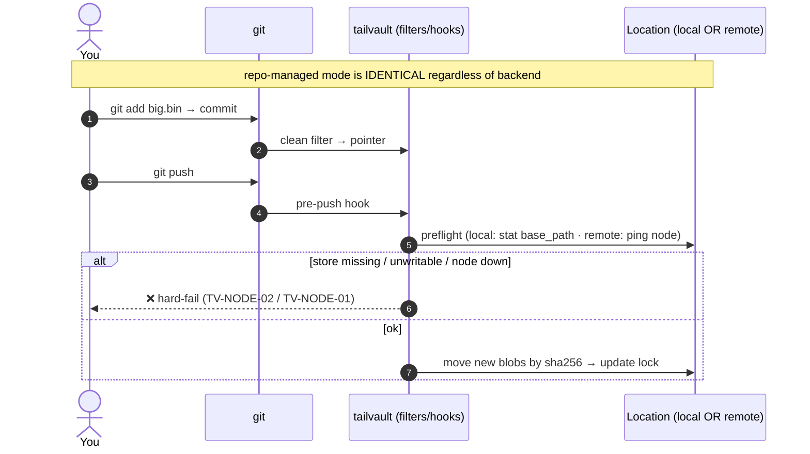

# Proposal: First-Class Local Storage Locations (`local` backend) + Local-First `setup`

**Status:** Draft | **Date:** 2026-06-13 | **Author:** AI Assistant
**Type:** Feature Addition + Architecture Change (deviates from frozen SPEC — see §SPEC Delta)

## Executive Summary

Today every storage location is a **remote tailnet node** over SSH (or, later,
Taildrive): `locations.Backend` only allows `ssh`/`taildrive`
(`internal/locations/locations.go:21-24`), and `tailvault setup` forces an
interactive **peer pick-list** before you can register anything
(`internal/cli/register.go:43-51`). There is an internal `FSBackend` — a
content-addressed local-filesystem implementation of the full `Backend`
interface — but it exists only as a test double (`internal/backend/backend.go:1-7`)
and is not exposed to users.

This proposal makes **setting up a local storage location a first-class,
standalone capability**: a new `local` backend (exposing `FSBackend`), a
`tailvault setup` that **defaults to creating a local store** (with remote node
registration moved behind `tailvault setup --remote`), and a `tailvault init`
that **offers to create a local location** when a repo has none to point at.

Crucially, **this does not change git/repo-managed behavior.** A local store is
just another *location* a repo can target; on `push` the bytes **move** into it
exactly as they move to a remote node today — clean/smudge filters, hooks,
`tailvault.lock`, and the pointer schema are all untouched. The only new idea is
*where a location can live* (a local directory) and *how easily you can create
one* (a root command, no tailnet peer required).

Expected outcome: a one-command path to a working store on a single machine —
ideal for first-run onboarding, single-machine/offline use, and the Windows/WSL
testing track — without weakening the existing remote-node workflow.

## Background

### Current State

- **Backend enum is remote-only.** `BackendSSH` / `BackendTaildrive`
  (`locations.go:21-24`); `Location.Validate()` requires `node` + `base_path`,
  and a `user` (ssh) or `share` (taildrive) (`locations.go:113-135`).
- **`setup` is remote-first.** `registerInteractive` enumerates online peers and
  presents a pick-list; failure drops to manual node entry
  (`register.go:43-51`). There is no notion of "this machine is the store."
- **`FSBackend` already exists and is complete.** The `Backend` interface
  (Stat/Get/Put/PutOverwrite/Delete/List/HashObject) is implemented for the local
  filesystem with atomic temp-file+rename writes (`backend.go:65-114`) — it is the
  reusable test double every engine test runs against, so the local path is
  already exercised heavily. It is simply not wired to a user-facing backend
  string.
- **Federation transfer is SSH-only.** `SSH.TransferFrom` refuses any non-SSH
  source — *"no node-to-node path from %T into an ssh node"*
  (`internal/backend/ssh.go:215-219`). There is no node-to-node path between a
  local store and an SSH node.
- **Reachability/guarantees assume a remote node.** Preflight pings the node
  before byte moves (`ssh.go:64-72`); the product promise is "green push = bytes
  landed on a separate node; hard-fail if it is down."

### Why This Change?

- **Onboarding friction.** A new user with no Pi/SSD cannot try Tailvault without
  first standing up a remote node. A local store removes that wall.
- **Single-machine / offline use.** Content-addressing, dedup, delete
  propagation, and (opt-in) history are useful even when the bytes stay on one
  machine.
- **Testing & the Windows/WSL track.** A local store lets us exercise the full
  repo-managed and vault flows without provisioning a second machine.
- **The capability is 90% built.** `FSBackend` is done and proven; this is mostly
  wiring + UX + a SPEC update, not new storage code.

### Goals and Non-Goals

**Goals**

- A `local` backend selectable as a location (`backend = "local"`, `base_path`
  only — no `node`/`user`/`share`).
- `tailvault setup` **defaults to creating a local store** (prompted path), with
  `tailvault setup --remote` preserving today's peer-selection flow verbatim.
- `tailvault init` offers to create a local location when none exists (explicit
  prompt, never silent).
- **Zero change** to git/repo-managed mechanics: filters, hooks, push/pull, lock,
  pointer schema all behave identically; bytes still move to the location.
- Preserve *no-silent-success*: a missing/unwritable local store dir **hard-fails
  loudly**, never a silent green.

**Non-Goals**

- **Local stores in a federation.** A `local` member cannot node-to-node with SSH
  members (`TransferFrom` gap). v1 scopes `local` as **standalone** (a vault
  and/or a single repo's store). Federating local + remote is future work.
- Changing remote-node behavior, the SSH backend, or the federation contract for
  SSH members.
- Taildrive changes.
- Defaulting the store *inside* the repo working tree (see Detailed Design —
  default is the home store; cwd is a guarded opt-in).

## Proposed Solution

### Overview

Add `local` as a third `Backend`, backed by the existing `FSBackend`. Make
`setup` create one by default; relocate remote registration to `setup --remote`.
Teach `init` to offer local creation. Define local reachability as a `base_path`
stat. Update the SPEC's backend enum + reachability sections and mark local as
non-federated for now.

### Architecture





### Detailed Design

#### New backend value + validation

**`internal/locations/locations.go`**

```go
const (
    BackendSSH       Backend = "ssh"
    BackendTaildrive Backend = "taildrive"
    BackendLocal     Backend = "local" // NEW: content-addressed local FS, no node
)
```

`Location.Validate()` gains a `local` case: requires `base_path`, and **forbids**
`node`/`user`/`share` (they are meaningless and a filled value signals a mistake):

```go
case BackendLocal:
    if loc.Node != "" || loc.User != "" || loc.Share != "" {
        return tserr.ConfigErr("location: local backend takes only base_path (no node/user/share)", nil)
    }
```

(`Node` becomes optional for local; the existing "node is required" check at
`locations.go:114-116` moves into the ssh/taildrive cases.)

#### Backend construction

Wherever a `Backend` is built from a `Location` (the engine's backend factory),
add: `case BackendLocal: return &backend.FSBackend{Root: loc.BasePath}`. The
local store path is created on first write (`atomicReplace` already
`MkdirAll`s, `backend.go:71-73`).

#### Reachability & the preserved guarantee

`local` reachability is a **`base_path` stat + writability probe**, not a tailnet
ping:

- exists & writable → reachable.
- missing or unwritable → **`TV-NODE-02`** ("reachable but base_path not
  writable", `tserr.go:117-125`) — the same hard-fail surface remote uses, so
  *no-silent-success* holds. (A nonexistent dir that we *can* create on push is
  reachable; one under a read-only mount is not.)

`location ls` shows `REACHABLE = yes/no` from the stat. There is no `local`
preflight ping (the `FSBackend` has no `Ping`); the preflight simply skips ping
and relies on the first write's error mapping.

#### `setup` — local default, `--remote` flag

**`internal/cli/setup.go`** gains `--remote`:

- `tailvault setup` (no flag) → **local store creation**:
  - Prompt for the store path. **Default = the home store
    `~/.tailvault/stores/<name>`** (shared, repo-safe, dedups across projects).
  - Offer two easy alternates: a **cwd subfolder** (`./.tailvault-store`, with an
    auto-added `.gitignore` entry **and** a printed warning that repo-managed
    mode then keeps both working-tree bytes and a store copy on one disk), and a
    **single shared default home store** if none exists yet.
- `tailvault setup --remote` → the **current** `registerInteractive` peer-selection
  flow, unchanged.

> Design note on the cwd option: bytes still *move* into the store on push (repo
> behavior is unchanged); the only risk is the store *directory* sitting inside
> the repo, hence the forced `.gitignore` + warning. Home default avoids it
> entirely.

#### `location add` (scriptable)

Already flag-driven (`location.go:24-71`). With the enum + validation change,
`tailvault location add home --backend local --base-path ~/.tailvault/stores/home`
works with no further code. `--backend` default stays `ssh`.

#### `init` — offer to create a local location

When `tailvault init` finds no registered location, **prompt** (never auto-create
silently): *"No storage location is set up. Create a local one at
`~/.tailvault/stores/<repo>`? [y/N]"*. Yes → reuse the `setup` local path then
continue init; No → proceed and let the user point at a location later.

### SPEC Delta (this is the deviation to ratify)

`SPEC.md` is the frozen contract; this change requires three edits, called out
explicitly so the deviation is deliberate (CLAUDE.md: confirm before deviating):

1. **Backend enum:** add `local` to the allowed `backend` values; document that
   `local` requires only `base_path`.
2. **Reachability:** define local reachability as a `base_path` stat/writability
   check; map missing/unwritable to `TV-NODE-02`; state local performs no tailnet
   ping.
3. **Scope statement:** local backend is **standalone** (repo store and/or vault);
   it is **not a federation member** in this version (no node-to-node transfer
   path). Federation semantics (exit 4/6, "cannot prove absence") are unchanged
   for SSH members and simply do not apply to a local-only setup.

## Implementation Plan

### Task Breakdown

#### Phase 1: Backend wiring [~4 hrs]
- [ ] **1.1** Add `BackendLocal`; rework `Validate()` (node optional for local;
      forbid node/user/share) — `internal/locations/locations.go` + tests.
- [ ] **1.2** Backend factory `case BackendLocal → FSBackend{Root: base_path}` —
      (engine backend constructor) + test.
- [ ] **1.3** Local reachability check (stat + writability) feeding
      `location ls` — `internal/locations` (`Check`) + test.

#### Phase 2: setup / remote split [~5 hrs]
- [ ] **2.1** `setup --remote`; default `setup` → local store prompt (home
      default, cwd + shared alternates) — `internal/cli/setup.go`, `register.go`.
- [ ] **2.2** cwd opt-in writes `.gitignore` entry + prints the double-disk
      warning.
- [ ] **2.3** Command + golden-output tests (deterministic prompter, no real
      tailnet) — `internal/cli/setup_test.go`.

#### Phase 3: init integration [~3 hrs]
- [ ] **3.1** `init` prompts to create a local location when none exists —
      `internal/cli/init.go` + test.

#### Phase 4: SPEC + docs [~4 hrs]
- [ ] **4.1** SPEC delta (enum, reachability, standalone scope) — `SPEC.md`.
- [ ] **4.2** Docs: `docs/commands.md` (setup/--remote, local backend),
      `docs/configuration.md` (local `locations.toml` shape),
      `docs/how-it-works.md` (local is a location like any other; disk/guarantee
      caveats).
- [ ] **4.3** `VERSION` +0.0.1 per task + `CHANGELOG.md` entries (CLAUDE.md rule).

### Risk Assessment

| Risk | Impact | Prob. | Mitigation |
| --- | --- | --- | --- |
| cwd store pollutes the repo | M | M | Home is the default; cwd forces `.gitignore` + warning. |
| Users expect local to federate | M | M | SPEC + docs state "standalone, not a federation member"; `fed join` refuses a local member with a clear error. |
| "No silent success" eroded for local | H | L | Missing/unwritable store → `TV-NODE-02` hard-fail; covered by tests. |
| Double disk on single-machine repo mode | L | M | Documented; vault mode avoids it; not a correctness issue. |
| SPEC deviation destabilizes contract | M | L | Changes are additive (new enum value, new reachability case); SSH/federation semantics untouched. |

## Impact Analysis

- **`internal/locations`** — enum + validation + reachability (direct, additive).
- **Backend factory** — one new `case` (direct).
- **`internal/cli` (`setup`, `register`, `init`)** — UX changes; remote flow
  preserved behind `--remote`.
- **`FSBackend`** — no change (already complete); just newly reachable in prod.
- **Filters/hooks/push/pull/lock/pointer** — **no change** (the core promise of
  this proposal).
- **Federation (`internal/fed`)** — `fed join` must reject a `local` member with a
  typed error; otherwise untouched.
- **Docs + SPEC** — additive sections.

## Testing Strategy

- **Unit:** `Validate()` for local (accepts base_path-only; rejects
  node/user/share); reachability stat (exists/writable/missing/read-only via a
  temp dir + a chmod-0500 dir); backend factory returns `FSBackend`.
- **Command:** `setup` default produces a `local` entry at the home default;
  `setup --remote` still yields the peer pick-list (stub prompter + stub status);
  cwd opt-in writes `.gitignore`; `init` prompt creates/declines.
- **Integration:** end-to-end repo-managed push/pull against a `local` location in
  a temp dir — same assertions the SSH e2e makes, proving filters/hooks/lock are
  backend-agnostic. Vault mode `put/get/ls` against a local location.
- **Negative:** push to a local location whose `base_path` is read-only →
  `TV-NODE-02`, non-zero exit, no partial "success". `fed join <local>` → typed
  refusal.

## Alternatives Considered

- **Default the store to the cwd (your first instinct).** Simplest mental model,
  but the store dir lands in the repo → must be gitignored, and risks committed
  blobs. Kept as a guarded opt-in, not the default.
- **A no-SSH "loopback" via SSH-to-self.** Register the local machine as an `ssh`
  location pointing at its own tailnet name. Works today with zero code, but
  requires sshd + self-auth and still pings the tailnet — heavier and more
  fragile than a real local backend.
- **Make local a full federation member now.** Requires new node-to-node transfer
  plumbing (the `TransferFrom` gap). Deferred to keep this change small and
  correct.
- **Do nothing.** Onboarding wall remains; `FSBackend` stays shelved; the
  Windows/WSL test track needs a second machine.

## Open Questions

- [ ] **Home store layout:** one shared `~/.tailvault/stores/default` that all
      repos may share (best dedup), per-name dirs, or both? (Lean: allow both;
      default to a per-name dir, document the shared option.)
- [ ] **`init` default name:** derive the local location name from the repo
      folder, or always prompt?
- [ ] **`location ls` for local:** show `base_path` in the NODE column, or add a
      PATH column? (Lean: reuse NODE to avoid a schema churn.)

## Appendix — File Inventory

**Modified**
- `internal/locations/locations.go` — `BackendLocal`, `Validate`, reachability.
- `internal/cli/setup.go`, `internal/cli/register.go` — local default + `--remote`.
- `internal/cli/init.go` — offer-to-create prompt.
- (engine backend factory) — `FSBackend` case.
- `internal/fed/*` — reject local members from federation.
- `SPEC.md`, `docs/commands.md`, `docs/configuration.md`, `docs/how-it-works.md`.
- `VERSION`, `CHANGELOG.md`.

**Created**
- `local-storage-proposal.md` — this document.
- Tests alongside each modified package.

**Unchanged (intentionally)**
- `internal/filter`, `internal/hooks`, `internal/push`, `internal/pull`,
  `internal/lock`, `internal/pointer`, `internal/backend/backend.go` (FSBackend).

### Effort

- Development ~12 hrs · Tests ~6 hrs · SPEC/Docs ~4 hrs · **Total ~22 hrs (~3 days)**
