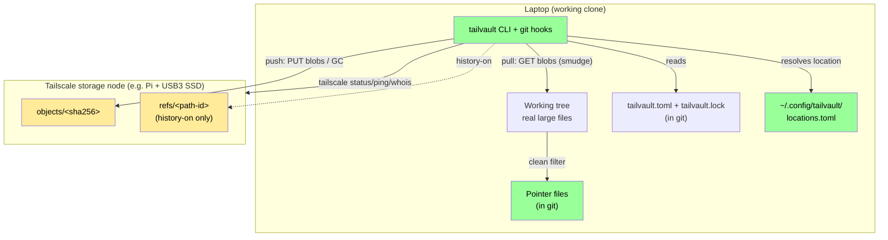
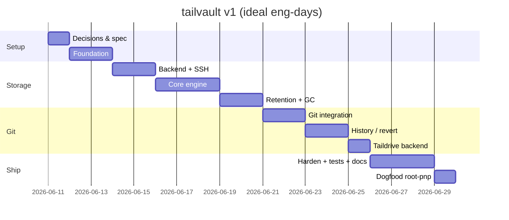

# Proposal: tailvault — a Tailscale-native distributed storage system with first-class git support

**Status:** Part I (v1, Blocks 1–2) **SHIPPED** · Part II (Federation, Blocks 3–7) Draft
**Date:** 2026-06-11 · **Author:** AI Assistant
**Type:** Feature Addition · **Scope:** v1 blueprint (implemented) + v2 federation blueprint

> **Part I** below is the original v1 blueprint, now implemented (PR #1, merged
> at v0.0.43; normative contract frozen in [`SPEC.md`](./SPEC.md)). **Part II**
> (Federation & remote interaction) is the new design, distilled from the
> brainstorm log (`BRAINSTORM-block-3.md`, decisions D1–D31). Task files for
> Part II are not yet cut.

## Executive Summary

**Identity (v2):** tailvault is a **distributed Dropbox-style storage system
with first-class native git support, built on Tailscale plus custom logic,
protocols, processes, and security.** The v1 mission — a clean Git LFS
alternative — is now one native feature of that larger system: storage
locations across the tailnet federate into a single logical vault layer that
can be browsed, managed, and reorganized from any node, with no running server
anywhere.

`tailvault` v1 is a single-binary CLI that keeps large binary files **out of git
history** while staying in lockstep with `git push`/`git pull`. Bytes live in a
**content-addressed folder on a Tailscale node**; the repo carries only tiny
pointer + lock files. It is a clean, purpose-built alternative to Git LFS whose
defaults are tuned to **prevent bloat** — no version history unless you opt in,
and storage auto-prunes files you delete from git.

The immediate driver is `root-pnp` in this workspace: ~1.1 GB of print-and-play
PDFs/STLs that bloat every clone. tailvault parks those blobs on a home
Tailscale node (e.g. a Raspberry Pi with a USB3 SSD) and keeps the laptop clone
lean, while a green `git push` *guarantees* the bytes actually landed — or fails
loudly.

The tool deliberately carries almost no networking or auth code: addressing,
transport, liveness, authz, and identity all ride on Tailscale primitives.
tailvault owns only the config/lock formats, the content-addressed store + GC,
the git filter/hook glue, and the retention policy.

---

## Background

### Current State

- No tool exists yet — this is greenfield.
- The workspace is a git repo where each project subfolder is worked by an AI
  agent and committed directly. `root-pnp` alone is **1.1 GB** (PDFs, STLs, 3MF,
  PPTX). That weight is now in git history.
- Git LFS is the obvious incumbent but is rejected (see Alternatives): its
  retention keeps *every* version (opposite of what we want), it is git-only (no
  standalone use), and hosted LFS is pay-per-quota.

### Why This Change?

- Keep clones small and history lean without losing the actual deliverables.
- Self-host the blobs on hardware already on the tailnet — no cloud bill, no
  server to babysit, addressed by stable MagicDNS names.
- A push must be **atomic in spirit**: if the storage node is down or a blob is
  missing, the operation fails rather than silently advancing refs.

### Goals

- Content-addressed blob storage on a Tailscale-reachable folder (SSH or
  Taildrive backend).
- Syncs on `git push`/`pull` via git-native filter + hooks; also usable
  standalone with no git.
- Per-project config + lockfile **committed to the repo**; user-level registry of
  storage locations kept **out** of the repo.
- Interactive setup that registers a storage node by reading the **local Tailscale
  session** (`tailscale status --json`) for a pick-list, or by manual entry — with
  **no Tailscale login or stored credentials**.
- Legible, **structured errors with stable codes + exit codes**; every command
  preflights node reachability and aborts cleanly when the tailnet/node is down.
- Size + glob filtering; per-file/pattern `history` and `preserve` flags.
- History **off by default** (single current ref), but diffs and deletes always
  tracked. Auto-delete **on by default**, with per-file opt-out.
- Hard-fail on unreachable node / missing object. Per-branch retention.

### Non-Goals (v1)

- A served HTTP object API / always-on daemon (tracked as a **future** option in
  `DESIGN.md` §9; v1 is folder-only).
- Mobile devices as storage **hosts** (dropped; optional mirror only).
- Public exposure (Tailscale Funnel) — tailnet-only by design.
- Tailscale-API / OAuth login for **remote** node enumeration (storing an API
  token). v1 reads only the local session; API mode is opt-in and tracked as a
  Future item.
- Multi-writer concurrency beyond a deterministic lock merge (see Open Q2).
- A GUI/app (possible phase two).

---

## Proposed Solution

### Overview

A Go CLI (`tailvault`) wraps three things: (1) a small config/lock layer that
lives in the repo, (2) a content-addressed object store reachable over a
pluggable backend (SSH or Taildrive), and (3) git glue (a `clean`/`smudge`
filter + `pre-push`/`post-merge`/`post-checkout` hooks). The same engine runs
from the CLI directly for non-git use.

### Architecture



### Detailed Design

#### Repo-committed config — `tailvault.toml`

```toml
# tailvault project config — committed to the repo
version = 1

[storage]
location = "home-pi"      # name resolved via ~/.config/tailvault/locations.toml
subpath  = "root-pnp"     # optional child folder under the location's base_path

[rules]
min_size    = "5MB"                       # files >= this are vault-managed
include     = ["**/*.pdf", "**/*.stl", "**/*.3mf", "**/*.pptx"]
exclude     = ["**/*.tmp", "drafts/**"]
history     = false                        # default: no version history (anti-bloat)
auto_delete = true                         # default: prune from storage on git delete

# Per-pattern overrides; first match wins.
[[rules.overrides]]
match    = "masters/**"
history  = true
preserve = true                            # never auto-delete
```

#### Repo-committed state — `tailvault.lock`

The source of truth for "what is stored, where, and when." Committed so every
clone agrees.

```toml
version = 1
generated_by = "tailvault 0.1.0"

[[entry]]
path      = "pnp/Root - Clockwork Expansion/board.pdf"
sha256    = "9f2b1c…"                       # current content → objects/9f2b1c…
size      = 41231873
location  = "home-pi"
pushed_at = "2026-06-10T18:22:04Z"
pusher    = "ibte@laptop"                   # from `tailscale whois`
history   = false
preserve  = false
# history-on entries additionally carry, newest-first:
# versions = ["9f2b1c…", "7c10aa…"]
```

#### Pointer file (the in-git stand-in)

The `clean` filter replaces a large file's bytes with this on commit; `smudge`
restores real bytes on checkout.

```
tailvault.v1
sha256 9f2b1c…
size 41231873
location home-pi
```

#### User-level registry — `~/.config/tailvault/locations.toml` (NOT in repo)

```toml
[locations.home-pi]
node      = "home-pi.tailnet-name.ts.net"  # MagicDNS or 100.x IP
base_path = "/mnt/ssd/tailvault"            # on a USB3 SSD, not the boot SD
backend   = "ssh"                           # ssh | taildrive
user      = "ibte"

[locations.office-nas]
node      = "100.92.14.7"
base_path = "/vault"
backend   = "taildrive"
share     = "vault"
```

#### Storage layout on the node

```
<base_path>/<subpath>/
  objects/<sha256>     # content-addressed blobs, deduped
  refs/<path-id>       # history-on files only: newest-first list of shas
  meta/manifest.json   # optional bookkeeping (GC marks, integrity log)
```

#### CLI surface

```
tailvault setup                # interactive: register a node by picking from your
                               #   live tailnet (read from the local session) or by
                               #   manual entry, then write tailvault.toml + hooks
tailvault init                 # non-interactive: write tailvault.toml + .gitattributes, install hooks
tailvault location add <name>  # register a tailnode target (writes locations.toml);
                               #   --node to set manually, omit to pick from the tailnet
tailvault location ls          # list registered locations + live reachability
tailvault track <glob>         # add include rule(s) to tailvault.toml
tailvault status               # local-only / pushed / drifted / orphaned
tailvault push [--branch b]    # upload diffs, GC deletes, update lock; fail if node down
tailvault pull                 # fetch blobs the current tree/branch needs
tailvault revert <path> <sha>  # history-on files: repoint to an older blob
tailvault gc [--dry-run]       # prune unreferenced blobs per retention policy
tailvault verify               # re-hash stored blobs; report corruption/missing
```

#### Backend abstraction

```go
// Every backend is "a path that can hold objects/ and refs/".
type Backend interface {
    Stat(ctx, key string) (Meta, error)     // exists? size?
    Get(ctx, key string, w io.Writer) error
    Put(ctx, key string, r io.Reader) error // content-addressed: skip if Stat hits
    Delete(ctx, key string) error
    List(ctx, prefix string) ([]string, error)
}
// ssh: stream over `ssh user@node` (cat / dd / sha256sum remote-side helpers via stdin).
// taildrive: operate on a locally-mounted share path with os.* calls.
```

#### Push flow (the critical path)

```mermaid
sequenceDiagram
    participant G as git pre-push hook
    participant TV as tailvault push
    participant TS as tailscale
    participant N as storage node
    G->>TV: invoke with pushed refs
    TV->>TS: status/ping target node
    alt node unreachable
        TS-->>TV: down
        TV-->>G: exit 1 (push ABORTS)
    end
    TV->>TV: scan tree for vault-managed files (rules)
    loop each changed file
        TV->>TV: hash content -> sha
        alt sha == lock sha
            TV->>TV: no-op (covers move/rename)
        else new content
            TV->>N: Stat objects/sha
            alt missing
                TV->>N: Put objects/sha
            end
            TV->>TV: update lock entry; if history-off, mark old sha for GC
        end
    end
    TV->>TV: deleted files -> drop entry; mark sha for GC unless preserve
    TV->>N: GC marked shas not referenced by any branch lock
    TV->>TV: write tailvault.lock; `tailscale whois` -> pusher stamp
    TV-->>G: exit 0 -> git proceeds to push refs (incl. updated lock)
```

#### GC / per-branch retention (proposed resolution of Open Q1)

Mark-and-sweep keyed on **every local branch's committed `tailvault.lock`**: the
keep-set is the union of `sha256` (and `versions[]` for history-on entries)
across all branch tips. A blob in `objects/` that is in no branch's keep-set and
carries no `preserve` is eligible for deletion. This makes "delete on branch A
doesn't nuke a file branch B still uses" fall out naturally. `--dry-run` lists
what would be removed.

#### Revert flow

For a history-on file, `tailvault revert <path> <sha>` repoints the lock entry's
current `sha256` to the chosen prior version from `refs/<path-id>`, re-smudges
the working file, and commits the lock change. History-off files have no prior
versions to revert to (by design).

#### Tailscale integration points

Per `DESIGN.md` §5: MagicDNS/IP for addressing, Tailscale SSH for the SSH
backend, Taildrive for the folder backend, `tailscale status`/`ping` for
liveness + hard-fail, ACLs for authz, `tailscale whois` for the pusher stamp.
Funnel is never used.

#### Node discovery & location registration (reads the local session)

Registering a storage location should not require typing IPs by hand or handing
tailvault any Tailscale credentials. tailvault reads the **local, already
authenticated Tailscale session** via `tailscale status --json` and offers the
tailnet's nodes as a pick-list:

- `tailvault setup` / `tailvault location add` (interactive): enumerate online
  peers from `tailscale status --json`, let you pick one, prefill its MagicDNS
  name, then prompt for `base_path` and `backend`, and write the entry to
  `~/.config/tailvault/locations.toml`. Manual entry is always available as a
  fallback (`--node <magicdns-or-ip>`), so the flow works even when the daemon
  can't enumerate peers.
- **No Tailscale login or API token is involved.** tailvault never authenticates
  to the Tailscale control plane and never stores Tailscale credentials — it only
  reads the local daemon's existing view of the tailnet. (An optional, opt-in
  Tailscale-API mode for remote enumeration is explicitly **out of scope for v1**
  and tracked under Future.)
- Precondition: Tailscale must be installed and the machine logged into the
  tailnet. If `tailscale` is absent or the local node is logged out, discovery is
  skipped and tailvault falls back to manual entry with a clear message.

#### Error model — fail clearly when the node isn't reachable

Hard-fail is a core guarantee (`DESIGN.md` §2), and the failure must be
*legible*. **Every command that needs the storage node runs a preflight** (
`tailscale status` for tailnet health, then `tailscale ping` / a backend `Stat`
to the specific node) and **aborts before doing any partial work** if the node
isn't reachable. Errors are structured, not raw stack traces or SSH noise:

- A small set of typed conditions, each with a stable code, a one-line cause, and
  a concrete next step. Examples:
  - `TV-NET-01 — Tailscale not running.` *Cause:* `tailscaled` not reachable /
    `tailscale` not in PATH. *Fix:* start Tailscale and run `tailscale status`.
  - `TV-NET-02 — Not logged into the tailnet.` *Fix:* `tailscale up`.
  - `TV-NODE-01 — Storage node 'home-pi' is offline/unreachable.` *Cause:* peer
    not in `tailscale status`, or `ping`/`Stat` failed. *Fix:* check the node is
    powered on and connected; `tailvault location ls` shows live reachability.
  - `TV-NODE-02 — Node reachable but base_path not writable.` *Fix:* check the
    SSH user / Taildrive share and `base_path` permissions.
  - `TV-OBJ-01 — Expected blob <sha> missing on the node.` (integrity/`pull`).
- **Exit codes** are bucketed so scripts and the git hooks can branch on them:
  `0` success; `2` config/precondition (bad `tailvault.toml`, no location); `3`
  network/Tailscale down; `4` node unreachable; `5` integrity/missing blob. The
  `pre-push` hook surfaces the same code so a failed push reads obviously rather
  than as a generic git error.
- Preflight-first ordering guarantees a node-down failure leaves **no** partial
  upload and an **unadvanced** lock — the repo state never gets ahead of storage.

---

# Part II — Federation & remote interaction (v2 — Blocks 3–7, Draft)

> Distilled from `BRAINSTORM-block-3.md` (decisions D1–D31, holes H1–H12).
> Everything here is **serverless**: no daemon anywhere, ever. Nodes are
> passive storage + state; all execution is client-driven over SSH.

## Vision

One **logical federated layer** connects all storage locations on the tailnet:

1. **Federation** — fully distributed, async resolution. There is no global
   "online/offline": state is whatever the members you ping report. Partial
   views are first-class.
2. **Self-describing vaults** — each location carries a catalog describing
   every stored file and its sync mode (`git | manual`, extensible). Vaults
   natively hold **non-git files**.
3. **Remote interaction from any node** — browse, read metadata, download,
   ingest, move, and manage sync modes via the CLI, no repo checkout needed.
4. **Moves** — files move between/within locations; the next git sync resolves
   the new home through the logical layer (pull warns; `heal` rewrites the
   lock).

## Core designs

### Per-node WAL (write-ahead log) — the concurrency + partial-failure model

- Every storage node keeps its own hash-chained WAL (each entry embeds the
  hash of the previous entry → tamper-evident, no consensus needed).
- Every mutating op: **dry-run preflight** (fail early) → append **intent**
  record (op id, type, args, blob refs) → receipt → execute → confirm → mark
  done. Ops are idempotent with unique ids (retry-safe, dedupe).
- **WAL-as-lock:** a blob has exactly one home (single-home invariant), so
  every op on it must touch its home node — appending the intent IS acquiring
  the per-blob lock. First appender wins; later ops queue or fail
  "op in flight". No coordinator, no root server, no delay windows.
- Pending/failed ops surface on any later command that pings the node;
  `tailvault ops` lists, `ops retry` re-runs; unresolvable ops are flagged
  for physical fixing. Blocking is **per-blob ordering** only (no general
  dependency DAG). Done-entries are pruned by a journal GC.

### Catalog (vault-side state) + atomicity standards

- Each location's catalog: object set, per-file {id, genesis record, current
  sha256, logical path, sync_mode, timestamps, last_scanned}, a
  `[federation]` roster section, and a schema version field.
- Atomicity: temp-file + fsync + atomic rename for every blob/catalog/WAL
  write; write-ahead ordering (WAL intent → blob bytes → catalog → WAL done);
  crash anywhere = detectable + repairable by `verify`/`heal`. 3-way verify:
  lock ↔ catalog ↔ disk. No distributed transactions — saga + WAL +
  reconciliation is the whole model.

### File identity — genesis-hash IDs (dual addressing)

- Every federated file has (a) a stable **file ID** and (b) a **logical path**
  (`<location>/<relative-path>`) for display/navigation. Moves change the
  path, never the ID; locks/links reference the ID.
- `id = sha256(genesis record)` where the genesis record is the ingest WAL
  entry `{original content sha256, original relative path, ingest op id,
  origin node}`. Unique (op id + path salt), location-independent,
  deterministic — regeneratable by anyone holding the genesis record.
  Short 12-hex display form.
- The ID is **not** the content hash: manual files are editable in place, so
  content sha drifts until a scan re-hashes (verify distinguishes "corrupt"
  from "edited since last scan" via mtime/size + `last_scanned`).
- **Identity recovery** (self-certifying: a record hashing to the claimed id
  proves itself): lock entries embed the full genesis record (every repo
  clone = off-node identity backup); every `vault get` writes a pull receipt
  (`~/.tailvault/receipts/<id>.toml`); manual `vault restore-identity`
  verifies sha256(record)==id and re-seeds a rebuilt catalog. Never implicit.
  Residual risk (never-referenced file on a destroyed node) accepted —
  closed later by redundancy (GH issue).

### Resolution & reachability

- **Fan-out**: ping members, each reports what it has; the source's
  `moved_to` WAL/catalog record doubles as a forwarding pointer (finds files
  whose new home is currently offline).
- **Per-operation reachability scoping** — no global online requirement.
  Each command needs only the members its scope touches: get/mv/rm → the
  home node; ls/search → all members; **gc → all members** (its scope is all
  references). Roster updates (join/leave) apply to reachable members and
  queue pending WAL ops for the rest.
- **Client state caches** (advisory, never authoritative): every reading
  client persists current + previous federation snapshots
  (`~/.tailvault/cache/fed-<id>/`) — used to distinguish "was here, now
  offline" from "never existed", to show last-known state, and to detect
  roster changes. Live pings always win.
- **Error semantics** (SPEC v2, new `TV-FED-*` codes, proposed exit 6):
  found at recorded home → success; found at a different member → success +
  WARN (run `heal`); not found among reachable with ≥1 member unreachable →
  TV-FED partial-view hard-fail ("cannot prove absence"); not found with all
  reachable and no pending move → TV-OBJ missing. Every remote view carries
  reachability metadata.

### Membership: join / leave / evict

- Roster lives in each member's catalog `[federation]` section, mirrored in
  clients' `locations.toml` + caches. `fed join` = client-driven WAL op on
  every member (pending for unreachable ones).
- **Leave = clean detach** (not blocked-until-empty): the leaver's files drop
  out of the federated tree; every repo/sync referencing them gets a WARNING
  ("repush to a new location or resync from a moved copy") via state change
  + committed lock history. The leaver's disk is untouched.
- `fed evict <member>` (manual, password-gated) declares a dead node departed
  — the only way to distinguish "crashed forever" from "gone".

### Ingestion — three paths for non-git files (default `sync_mode = manual`)

1. **Manual + track**: drop a file into the storage folder by hand, then run
   `track` (locally or remotely) → catch-up WAL entries. On-demand
   `vault scan` reconciles disk ↔ catalog (absorbs manual moves/deletes).
   A resident OS-hook watcher is explicitly OUT (first daemon-shaped thing) —
   optional later add-on (GH issue).
2. **Creation (bootstrap)**: first broadcast of a storage root tracks ALL
   files/subfolders by default; opt-out via `.tailvaultignore`
   (gitignore-style globs, overridden by explicit `track`) and an init-time
   deselect flag. Resumable via WAL (huge roots).
3. **Push (remote ingest)**: `vault put` sends a local file to a chosen path
   in an active location; on name conflict prompt copy/rename/stop (or
   `--on-conflict=` for scripts). After push the **vault copy is the
   original**; the local source is a deletable clone.

### Security & transport

- **Reuse built primitives only** — never roll our own crypto/transport.
  Tailscale WireGuard + SSH provide encryption, identity (whois), key
  exchange. Move transport = **node-to-node SSH/rsync over the tailnet**
  (Taildrop rejected: inbox/staging delivery, not path-to-path).
- Mutating remote ops (mv, rm, sync-mode change, remote gc, evict) require a
  **per-node password** (may be identical across nodes), stored as an
  **argon2id hash** on the node (no recovery — reset requires SSH/physical
  access). Reads ride tailnet ACL + SSH alone.
- WAL hash-chaining gives tamper-evident history; Block 5 is a dedicated
  security analysis (threat model, perms, chain-verify tooling, whois
  assumptions, SSH hardening, privacy audit of catalogs/receipts,
  govulncheck CI, parser fuzzing).

### GC under federation

- Only `sync_mode = git` objects are ever GC candidates — manual files are
  deleted solely by explicit user action.
- gc skips any blob with a pending WAL intent, and hard-fails unless ALL
  members answered (deletes never tolerate partial views).

### CLI surface (v2 additions)

```
tailvault vault ls|stat|get|put|mv|rm|scan|passwd|restore-identity
tailvault fed init|join|leave|evict|status
tailvault ops [list]|retry
tailvault heal
tailvault track            # gains manual-ingest registration mode
```

### Edge-case discipline

`EDGE-CASES.md` is a running log: every dev/QA appends edge cases discovered
while building Blocks 3–5 (what was chosen, punted, or worked). Block 6's
design (task 56) consumes that log — it is deliberately designed only after
the layers beneath exist. Block 7's dogfood appends late entries for a future
iteration.

---

## Implementation Plan

Estimates are in **ideal engineering days** for a solo developer comfortable with
Go and git internals. See the Effort section for calendar conversion and an
MVP-vs-full split.

### Task Breakdown

#### Phase 0 — Decisions & spec freeze [0.5 d]
- [ ] Resolve the Open Questions below (language, backend order, lock-merge, GC).
- [ ] Lock the `tailvault.toml` / `tailvault.lock` / pointer schemas.

#### Phase 1 — Foundation [2 d]
- [ ] Go module + Cobra CLI skeleton; `init`, `location add`, interactive `setup`.
- [ ] Node discovery from the **local session** (`tailscale status --json` parse)
      → pick-list; manual-entry fallback; write `locations.toml`.
- [ ] Config/lock parse + write (TOML); path-id + sha256 hashing.
- [ ] Rule engine: size threshold + include/exclude globs.

#### Phase 2 — Backend layer + SSH [2 d]
- [ ] `Backend` interface; SSH implementation (Stat/Get/Put/Delete/List).
- [ ] `tailscale status/ping` preflight; hard-fail on unreachable.
- [ ] **Structured error model**: typed conditions + stable codes (`TV-NET-*`,
      `TV-NODE-*`, `TV-OBJ-*`) + bucketed exit codes; `location ls` reachability.

#### Phase 3 — Core engine [3 d]
- [ ] `track`, `status`; diff detection vs lock.
- [ ] `push` (upload diffs, dedup-on-Stat, lock update, pusher stamp).
- [ ] `pull` (fetch needed blobs, integrity check).

#### Phase 4 — Retention + GC [2 d]
- [ ] Delete detection; `auto_delete` + `preserve`.
- [ ] Per-branch mark-and-sweep `gc` with `--dry-run`.

#### Phase 5 — Git integration [2 d]
- [ ] `clean`/`smudge` filter driver + pointer format.
- [ ] `pre-push` / `post-merge` / `post-checkout` hooks calling the engine.

#### Phase 6 — History / revert [1.5 d]
- [ ] Opt-in `history`; `refs/<path-id>`; `revert`.

#### Phase 7 — Taildrive backend [1 d]
- [ ] Mounted-path backend; backend selection from `locations.toml`.

#### Phase 8 — Hardening, tests, docs [3 d]
- [ ] `verify`; lock-merge driver; unit + integration tests; README/usage.

#### Phase 9 — Dogfood on root-pnp [1 d]
- [ ] Migrate `root-pnp`'s blobs into a real location; verify lean clone + push.
      *(Moved into Block 6 — runs after federation, with grown scope.)*

### Part II task breakdown (Blocks 3–7 — preliminary; task files cut later)

> Phases 0–8 above = Blocks 1–2, **shipped**. The following blocks are new.
> No migration path is needed: no real v1 vaults exist (D29).

#### Block 3 — Vault catalog + federation core
- [ ] 3.1 **SPEC v2 freeze**: catalog schema, WAL entry + hash-chain, genesis
      record / file-ID, pull receipts, `.tailvaultignore`, `[federation]`
      roster, client cache format, `TV-FED-*` codes + exit 6, password hash
      file. (Everything else cites this.)
- [ ] 3.2 `internal/catalog` — parse/write/atomic-update; schema version.
- [ ] 3.3 `internal/wal` — append/read, hash-chain verify, op ids, intent
      lifecycle, per-blob blocking, pruning.
- [ ] 3.4 `internal/identity` — genesis records, ID mint/recompute/verify,
      receipts.
- [ ] 3.5 `internal/fed` — roster parse/merge, client state caches,
      reachability accounting.
- [ ] 3.6 Resolution engine — fan-out, `moved_to` forwarding, partial-view
      semantics, TV-FED errors.
- [ ] 3.7 `vault init` (bootstrap ingestion): track-all default,
      `.tailvaultignore`, deselect flag, WAL-resumable.
- [ ] 3.8 `vault scan` — disk↔catalog reconcile, catch-up WAL, manual-file
      freshness.
- [ ] 3.9 Lock schema v2 (embed id+genesis), pull WARN, `heal`.
- [ ] 3.10 gc federation-awareness: pending-intent skip, git-only scoping,
      all-members gate.
- [ ] 3.11 `ops` — list pending/failed, retry, dependency display.
- [ ] 3.12 3-way verify (lock↔catalog↔disk) + edited-vs-corrupt logic.
- [ ] 3.13 Multi-node integration harness (N stub backends, down-member
      simulation) + Block 3 suite.

#### Block 4 — Remote interaction CLI + ingestion + moves
- [ ] 4.1 Remote sha256 short-circuit (existing deviation DEV-C1 —
      prerequisite, lands first).
- [ ] 4.2 `vault ls|stat` — logical tree, ID display, reachability metadata.
- [ ] 4.3 `vault get` — download + pull receipt.
- [ ] 4.4 `vault put` — remote ingest, `--on-conflict=copy|rename|stop`,
      vault-copy-becomes-original.
- [ ] 4.5 `vault mv` — intra- + cross-location (SSH/rsync, WAL-locked both
      ends, `moved_to` record).
- [ ] 4.6 `vault rm` + sync-mode management.
- [ ] 4.7 `vault passwd` + argon2id auth enforcement on mutating remote ops.
- [ ] 4.8 `fed init|join|leave|evict|status`.
- [ ] 4.9 `vault restore-identity`.
- [ ] 4.10 `track` manual-ingest mode.
- [ ] 4.11 Block 4 integration suite (remote ops, auth, conflicts,
      leave/evict).

#### Block 5 — Security analysis & hardening (tasks 51–55)
- [ ] 5.0 **STEP 0 (human-in-the-loop, first):** the maintainer manually runs
      **Claude's security review** (`/security-review`) over the repo and
      commits the artifacts under `docs/security/`; all Block 5 analysis runs
      off them (every automated finding gets a disposition).
- [ ] 5.1 Threat-model doc (task 51) → 5.2 adversarial auth review (52) →
      5.3 WAL chain-verify tooling (53) → 5.4 parser fuzzing + govulncheck CI
      (54) → 5.5 privacy audit + SSH hardening guide (55).

#### Block 6 — Edge-case handling (task 56)
- [ ] Designed only after Blocks 3–5, consuming the `EDGE-CASES.md` running
      log; triage + cut its own implementation task set (numbered 60+); never
      punt invariant-threatening entries.

#### Block 7 — Dogfood (FINAL: tasks 57 → 58 → 59 → 26)
Guided manual validation of the **entire system** — AI directs, maintainer
runs — local-mock-first on the **dogfood rig** (generated test repo + files +
localhost vaults; task 57 creates it), real hardware only at the end. Each
task is mirrored 1:1 as its own GitHub issue.
- [ ] 7.1 (task 57) Config-matrix manual tests on the rig (backends,
      min_size/units, rules/overrides, history, retention, ignore, sync
      modes, 2-member local federation, auth on/off).
- [ ] 7.2 (task 58) Route walkthroughs: every CLI command/route, all four
      groups (repo lifecycle, checkout-free vault ops, federation
      membership, maintenance), exit codes spot-checked vs SPEC.
- [ ] 7.3 (task 59) Failure & recovery drills: node down, interrupted ops,
      corruption/tamper, auth/membership, git-side recovery — every failure
      loud + every recovery verified clean.
- [ ] 7.4 (task 26) The real use case: migrate `root-pnp` to 2+ real nodes;
      federation walkthrough; live security checks; rollback runbook.

### Critical Path



### Dependencies

- **External:** Go toolchain; Tailscale installed on laptop + node; `tailscale`
  CLI in PATH; a USB3 SSD on the node for the vault path.
- **Internal:** one decision pass from you (Open Questions) before Phase 1.

### Risk Assessment

| Risk | Impact | Prob. | Mitigation |
|---|---|---|---|
| `tailvault.lock` merge conflicts between clients | M | M | Custom git merge driver (per-path union); single-writer in practice early on (Open Q2) |
| GC deletes a blob another branch/remote needs | H | L | Mark-and-sweep across **all** branch locks + `--dry-run`; never delete `preserve` |
| Taildrive/WebDAV flakiness at ~1 GB | M | M | Ship SSH backend first; Taildrive opt-in (Open Q3) |
| Partial push leaves lock ahead of storage | H | L | Upload blobs **before** writing/committing lock; verify Stat post-Put |
| `smudge` round-trips slow checkouts | M | M | Pointer carries size+location; fetch lazily / batch; cache locally |
| Pi crypto throughput caps transfers | L | M | Documented expectation (few min/GB); not a failure mode |
| *(v2)* Catalog drifts from disk/lock | H | M | Atomic write ordering + WAL; 3-way verify; `vault scan` reconcile |
| *(v2)* Concurrent ops on one blob race | H | M | WAL-as-lock (intent append = lock); per-blob ordering; gc skips pending intents |
| *(v2)* Partial view misread as "deleted" | H | M | TV-FED partial-view error class; client prev-state caches; `moved_to` forwarding |
| *(v2)* Identity lost on node disk loss | M | L | Genesis records replicated into locks + pull receipts; manual `restore-identity`; redundancy later (GH) |
| *(v2)* Password/auth weakens hard guarantees | M | M | argon2id hash only, no recovery; Block 5 dedicated security analysis |

---

## Testing Strategy

### Unit
- Rule engine: size threshold + include/exclude glob matching (incl. overrides).
- Hashing + pointer round-trip (`clean` → pointer → `smudge` → bytes).
- Lock diff: detect add / content-diff / move-rename (same sha) / delete.

### Integration (against a local SSH "node" and a temp Taildrive-like dir)
- **Hard-fail:** node unreachable → `push` exits non-zero, refs not advanced.
- **Dedup:** re-push unchanged tree → zero `Put` calls.
- **Move/rename:** path change, same content → zero transfer, lock key renamed.
- **Delete + auto_delete:** removing a file prunes its blob; `preserve` keeps it.
- **Per-branch GC:** blob referenced by branch B survives a delete on branch A.
- **History/revert:** opt-in file keeps versions; `revert` restores an old sha.
- **Integrity:** corrupt a stored blob → `pull`/`verify` detects mismatch.

### Integration (v2 — multi-node harness: N stub backends, simulated down members)
- **WAL:** intent→done lifecycle; crash between any two write steps is detected
  and repaired by verify/heal; hash-chain tamper detection; retry idempotence.
- **WAL-as-lock:** concurrent ops on one blob serialize; gc skips pending
  intents; ops on different blobs proceed independently.
- **Resolution:** moved file found via fan-out and via `moved_to` when the new
  home is down; TV-FED partial-view vs TV-OBJ missing distinction.
- **Membership:** join with a member down (pending op applied later); leave
  detaches + warns referencing repos; evict of a dead member.
- **Ingestion:** bootstrap honors `.tailvaultignore`; put conflict modes;
  manual edit detected by scan (edited ≠ corrupt).
- **Auth:** mutating remote ops rejected without password; reads unaffected.
- **Identity:** restore-identity round-trip from a lock entry and a receipt.

### Manual / acceptance
- [ ] End-to-end on a real Pi over Tailscale with a USB3 SSD.
- [ ] Dogfood (Block 7, final): config-matrix + route walkthroughs + failure
      drills on the local mock rig first (tasks 57–59), then the real use
      case — `root-pnp` clone is lean; `git push` lands blobs and fails when
      the Pi is offline; 2+ node federation walkthrough (init/join/put/mv/
      leave) with guided per-command acceptance (task 26).

---

## Distribution & Rollout

- **Build:** `go build` → single static binary; release per-OS (darwin/linux,
  amd64/arm64) via GoReleaser. Optional Homebrew tap.
- **Install on a repo:** `tailvault init` writes `tailvault.toml`, `.gitattributes`,
  and installs hooks; `tailvault location add` registers the node.
- **Phased adoption:** start read-mostly on `root-pnp` behind a branch; verify
  lean clone + reliable push/pull before flipping other projects.
- **Rollback:** the tool is additive — pointers + lock are just files; removing
  the filter/hooks and restoring real files from the vault returns to plain git.

---

## Alternatives Considered

(From `DESIGN.md` §7 — full reasoning there.)
- **Git LFS (hosted / self-hosted):** retention is the opposite of ours; git-only;
  hosted is metered; self-hosted needs a server. Rejected.
- **Raw SSH/Taildrive bare repo, no tool:** no filtering/versioning/retention.
- **Syncthing:** silent divergence instead of hard-fail. Dangerous for git.
- **git-annex / DVC:** content sync decoupled from `git push` — green push ≠ bytes
  landed. Breaks the core guarantee.
- **Do nothing:** 1.1 GB stays in history; every clone pays for it forever.

---

## Open Questions — RESOLVED (frozen in `SPEC.md`; recommendations adopted)

> Historical (Part I). All eight were resolved before implementation; the
> answers are normative in `SPEC.md`. Part II decisions (D1–D31) are logged in
> `BRAINSTORM-block-3.md` and summarized in Part II above.

- [ ] **Q1 — Language/runtime.** Go (single static binary, first-class Tailscale
  ecosystem, easy cross-compile to the Pi) vs a scripted tool (Python/TS).
  **Recommend: Go.**
- [ ] **Q2 — First backend.** SSH (most reliable at ~1 GB) vs Taildrive (the
  "node runs only Tailscale" aesthetic). **Recommend: SSH first, Taildrive in
  Phase 7.**
- [ ] **Q3 — `tailvault.lock` conflict policy.** Custom per-path **union** merge
  driver, vs last-writer-wins, vs declaring single-writer for now. **Recommend:
  ship a per-path union merge driver; assume single active writer early.**
- [ ] **Q4 — GC trigger.** Auto-GC inside every `push` vs an explicit
  `tailvault gc` only. **Recommend: mark on push, sweep on explicit `gc`
  (with `--dry-run`)** — safer, avoids surprise deletes mid-push.
- [ ] **Q5 — Default `min_size`.** What threshold counts as "large"? **Recommend:
  5 MB**, overridable per project.
- [ ] **Q6 — Pointer resolution on checkout.** Eager (fetch all on
  `post-checkout`) vs lazy (fetch on first access). Eager is simpler; lazy keeps
  checkouts instant but needs an access shim. **Recommend: eager for v1, lazy as
  a later option.**
- [ ] **Q7 — Identity stamp source.** Use `tailscale whois` (tailnet identity) for
  the `pusher` field, or git `user.email`? **Recommend: `tailscale whois`, fall
  back to git identity.**
- [ ] **Q8 — Scope of v1.** Ship **full v1** (history/revert + Taildrive
  included) or an **MVP** first (SSH only, no history, no Taildrive) and iterate?
  This drives the timeline below.

---

## Future (tracked, not in current blocks)

GitHub issues to file alongside Part II:

- **GH-1** — DEV-B1: taildrive mount-state detection (existing-but-unmounted
  mountpoint not detected; accepted deviation from Blocks 1–2).
- **GH-2** — DEV-C1: remote sha256 short-circuit for `verify`/remote reads
  (accepted deviation; **promoted to Block 4 prerequisite**, task 4.1).
- **GH-3** — Blob redundancy/mirroring (multi-home blobs) + redundant genesis
  backups; closes the residual identity-loss risk. Deferred design.
- **GH-4** — Optional resident watcher (OS hooks → WAL replay of manual file
  ops: inotify/launchd/systemd-path; opt-in per node; explicit deviation from
  serverless purity). Full design detail goes in the issue.

Earlier future items remain tracked:

- **Served HTTP object API** behind `tailscale serve` — random-access reads,
  identity auth, GC coordination, app frontend. Operational cost = an always-on
  daemon. Full analysis in `DESIGN.md` §9.
- **Lazy/partial checkout**, a GUI/app, and S3-compatible backends.
- **Opt-in Tailscale-API discovery** — enumerate tailnet nodes via the Tailscale
  API (OAuth/API key, token stored in the OS keychain) for machines where the
  local daemon can't, or for remote registration. Off by default; v1 uses the
  local session only.

---

## Appendix

### Glossary
- **Content-addressed:** a blob is stored under the hash of its bytes, so
  identical content dedupes and a move/rename never re-uploads.
- **Pointer file:** the small text stand-in committed to git in place of the
  blob.
- **path-id:** a stable hash of a file's logical path, used to key history refs.
- **Backend:** the transport to the storage folder (SSH or Taildrive).

### File Inventory (to be created during build)
- **Created:** `cmd/tailvault/*`, `internal/{config,lock,store,backend,gitglue,gc}/*`,
  `tailvault.toml`/`tailvault.lock`/`.gitattributes` per repo, `~/.config/tailvault/locations.toml`.
- **Modified:** none (greenfield).
- **Deleted:** none.

### Effort

Ideal engineering days (solo, Go-fluent), summed from the plan:

| Track | Days |
|---|---|
| Setup (Phase 0–1) | 2.5 |
| Storage + core (Phase 2–4) | 7 |
| Git + history + Taildrive (Phase 5–7) | 4.5 |
| Harden + tests + dogfood (Phase 8–9) | 4 |
| **Total (full v1)** | **~18 ideal eng-days** |

**Calendar conversion** (ideal days run ~60–70% efficient once meetings, context
switches, and unknowns are included):

- **MVP** (SSH backend; `init/track/status/push/pull/gc`; **no** history, **no**
  Taildrive — Phases 0–5 + light test ≈ 10 ideal days): **~2 weeks full-time**,
  or ~4–5 weeks at part-time/evenings.
- **Full v1** (everything above, ~18 ideal days): **~3.5–4 weeks full-time**, or
  ~7–9 weeks part-time.

These assume the Open Questions are resolved up front and a Pi + USB3 SSD are
ready to test against. The single biggest swing factor is **Q8 (MVP vs full
v1)**; **Q3 (lock-merge)** and **Q1 (Go vs script)** are the next largest.
```
