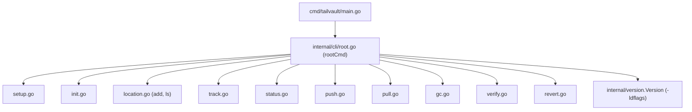

# Task 02: Go module + Cobra CLI skeleton

**Proposal:** [proposal.md](../proposal.md) · **Proposal Section:** CLI surface; Distribution & Rollout (single static binary, `go build`) · **Block:** 1 (MVP) · **Estimated Effort:** 0.5 day · **Dependencies:** Task 01 (frozen command list + schema contract) · **Type:** Foundation

## Summary

This task stands up the Go module and the Cobra command tree so every later task has a `cmd`/`internal` home to attach real behaviour to. It creates the root `tailvault` command and a stub for each subcommand named in the proposal's CLI surface — `setup`, `init`, `location` (with `add`/`ls`), `track`, `status`, `push`, `pull`, `gc`, `verify`, `revert` — each printing `"not implemented yet"` and returning cleanly. The point is a compiling, runnable skeleton, not behaviour.

`--version` must print the project version embedded at **build time** from the repo-root `VERSION` file via `-ldflags "-X .../internal/version.Version=…"`. Per `CLAUDE.md` and `CONTRIBUTING.md`, the version is never hardcoded in source: the default `Version` string is a placeholder (`"dev"`) overwritten by the linker. A `Makefile` reads `VERSION` and wires the ldflags so `make build` produces a binary whose `--version` equals the file's contents.

End-state: `go build ./...` succeeds, `tailvault --help` lists every command, and `tailvault --version` prints the `VERSION` contents when built via the Makefile. This unblocks Tasks 03+ which replace each stub's body with real logic.

## Context

### Related packages
- `cmd/tailvault/` — `main.go` entry point.
- `internal/cli/` — root command + one file per subcommand stub.
- `internal/version/` — the linker-injected `Version` var.

### Architecture context



### Prerequisites
- [ ] Task 01 complete — `SPEC.md` fixes the exact subcommand set and the "version from VERSION" rule.

## Changes Required

**File:** `go.mod`
**Action:** Create via `go mod init github.com/<owner>/tailvault` (confirm module path with maintainer; use the repo's canonical path).
**Purpose:** Declare the module and the `spf13/cobra` dependency.

```
module github.com/Ibtesam-Mahmood/tailvault

go 1.22

require github.com/spf13/cobra v1.8.0
```

**File:** `internal/version/version.go`
**Action:** Create.
**Purpose:** Hold the linker-injected version. Never hardcode the real number here.

```go
package version

// Version is overwritten at build time via:
//   -ldflags "-X github.com/Ibtesam-Mahmood/tailvault/internal/version.Version=$(cat VERSION)"
// "dev" is the placeholder for `go run` / un-flagged `go build`.
var Version = "dev"
```

**File:** `cmd/tailvault/main.go`
**Action:** Create.
**Purpose:** Entry point; delegate to the CLI root and map its error to a process exit code.

```go
package main

import (
	"os"

	"github.com/Ibtesam-Mahmood/tailvault/internal/cli"
)

func main() {
	os.Exit(cli.Execute())
}
```

**File:** `internal/cli/root.go`
**Action:** Create.
**Purpose:** Build the root command, attach `--version`, register subcommands, run.

```go
package cli

import (
	"github.com/spf13/cobra"

	"github.com/Ibtesam-Mahmood/tailvault/internal/version"
)

func newRootCmd() *cobra.Command {
	root := &cobra.Command{
		Use:           "tailvault",
		Short:         "Tailscale-native large-file store for git",
		Version:       version.Version,
		SilenceUsage:  true,
		SilenceErrors: true,
	}
	root.SetVersionTemplate("{{.Version}}\n")
	root.AddCommand(
		newSetupCmd(), newInitCmd(), newLocationCmd(),
		newTrackCmd(), newStatusCmd(), newPushCmd(), newPullCmd(),
		newGCCmd(), newVerifyCmd(), newRevertCmd(),
	)
	return root
}

// Execute returns a process exit code (0 on success).
func Execute() int {
	if err := newRootCmd().Execute(); err != nil {
		return 1 // Task 07 replaces this with bucketed exit codes.
	}
	return 0
}
```

**File:** `internal/cli/<cmd>.go` (one per subcommand)
**Action:** Create a stub per command.
**Purpose:** Reserve the command surface; print "not implemented yet".

```go
package cli

import (
	"fmt"

	"github.com/spf13/cobra"
)

func newPushCmd() *cobra.Command {
	return &cobra.Command{
		Use:   "push",
		Short: "Upload diffs, GC deletes, update lock",
		RunE: func(cmd *cobra.Command, args []string) error {
			fmt.Fprintln(cmd.OutOrStdout(), "not implemented yet")
			return nil
		},
	}
}
```

`location` is a parent with `add` and `ls` children:

```go
func newLocationCmd() *cobra.Command {
	c := &cobra.Command{Use: "location", Short: "Manage storage locations"}
	add := &cobra.Command{
		Use:  "add <name>",
		Args: cobra.ExactArgs(1),
		RunE: notImplemented,
	}
	ls := &cobra.Command{Use: "ls", RunE: notImplemented}
	c.AddCommand(add, ls)
	return c
}

func notImplemented(cmd *cobra.Command, _ []string) error {
	fmt.Fprintln(cmd.OutOrStdout(), "not implemented yet")
	return nil
}
```

**File:** `Makefile`
**Action:** Create.
**Purpose:** Read `VERSION` and inject it; never duplicate the string.

```make
VERSION := $(shell cat VERSION)
PKG     := github.com/Ibtesam-Mahmood/tailvault
LDFLAGS := -X $(PKG)/internal/version.Version=$(VERSION)

.PHONY: build test vet fmt
build:
	go build -ldflags "$(LDFLAGS)" -o bin/tailvault ./cmd/tailvault
test:
	go test ./...
vet:
	go vet ./...
fmt:
	gofmt -l .
```

**Implementation Notes:**
- `SetVersionTemplate("{{.Version}}\n")` makes `--version` print just the version string, so the test can compare it exactly to `VERSION`.
- Keep each command in its own file for clean diffs as later tasks fill them in.
- Use `cmd.OutOrStdout()` (not `fmt.Println`) so tests can capture output.

**Key Considerations:**
- Confirm the module path with the maintainer before `go mod init`; it threads through every import.
- `Execute()` returns an `int` now so Task 07 can swap in the bucketed exit-code map without restructuring `main`.

## Implementation Checklist
- [ ] `go mod init` with the agreed module path; add `spf13/cobra`.
- [ ] `internal/version/version.go` with `Version = "dev"` placeholder.
- [ ] `cmd/tailvault/main.go` delegating to `cli.Execute()`.
- [ ] `internal/cli/root.go` wiring `--version` + all subcommands.
- [ ] One stub file per command (incl. `location add`/`ls`).
- [ ] `Makefile` reading `VERSION` into ldflags.
- [ ] `make build` produces `bin/tailvault`.

## Testing Requirements

`internal/cli/root_test.go` — table-driven, using `cobra`'s in-memory exec:

| Case | Setup | Assert |
|---|---|---|
| `--version` matches VERSION | set `version.Version` to fixture, run `--version` | stdout equals fixture + `\n` |
| `--help` lists all commands | run `--help` | output contains `setup init location track status push pull gc verify revert` |
| each stub runs | run e.g. `push` | exit 0, stdout `not implemented yet` |
| `location add` needs arg | run `location add` | error (ExactArgs(1)) |

Helper to capture output:

```go
func run(args ...string) (string, error) {
	c := newRootCmd()
	var buf bytes.Buffer
	c.SetOut(&buf); c.SetErr(&buf); c.SetArgs(args)
	err := c.Execute()
	return buf.String(), err
}
```

A shell-level smoke check for the Makefile path: `make build && ./bin/tailvault --version` equals `cat VERSION`.

## Validation Checklist
- [ ] `go build ./...` succeeds.
- [ ] `go test ./...` passes.
- [ ] `go vet ./...` clean.
- [ ] `gofmt -l .` clean.
- [ ] `make build && ./bin/tailvault --version` prints `VERSION` contents.
- [ ] Bump `VERSION` by `+0.0.1` and add a matching `## v<version>` entry to `CHANGELOG.md` in the same commit.

## Acceptance Criteria
- `tailvault --help` lists all ten command surfaces (`location` shown with `add`/`ls`).
- `tailvault --version`, when built via `make build`, equals the `VERSION` file exactly.
- Version is never hardcoded in any `.go` file (placeholder is `"dev"`).
- Repo builds, vets, and is gofmt-clean.

## Related Proposal Sections
- **CLI surface** — the command list this skeleton stubs verbatim.
- **Distribution & Rollout** — "`go build` → single static binary"; the Makefile/ldflags realize the build-time version embed required by `CLAUDE.md` ("embed `VERSION` at build time").

## Notes & Considerations
- **Gotcha:** `go run ./cmd/tailvault --version` prints `dev` (no ldflags) — that's expected; the build-time embed only happens via `make build` or a flagged `go build`. Document this so a reviewer isn't surprised.
- **For Next Task:** Task 03 fills `internal/config` and the `init`/`track` stubs begin reading/writing `tailvault.toml`. The command files exist now, so Task 03 only swaps `RunE` bodies.
- Prev: [task-01-spec-freeze.md](./task-01-spec-freeze.md) · Next: [task-03-config-parse.md](./task-03-config-parse.md)
