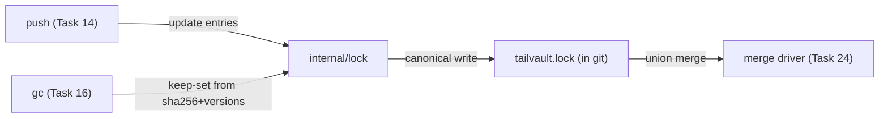

# Task 04: Lock parse/write — canonical `tailvault.lock`

**Proposal:** [proposal.md](../proposal.md) · **Proposal Section:** Detailed Design → `tailvault.lock`; Risk Assessment (lock merge conflicts row) · **Block:** 1 (MVP) · **Estimated Effort:** 0.5 day · **Dependencies:** Task 02 (Go module + CLI skeleton) · **Type:** Foundation

## Summary

`internal/lock` owns the repo-committed state file `tailvault.lock` — the source of truth for "what is stored, where, and when." This task implements parse + write in **canonical form** so the file is deterministic: entries sorted by `path`, a fixed field order within each entry, and `versions[]` always newest-first. Determinism is not cosmetic — it is the precondition for the per-path union merge driver (Task 24) to produce minimal, conflict-free diffs and for `git diff` on the lock to stay readable.

Each `[[entry]]` carries: `path`, `sha256`, `size`, `location`, `pushed_at` (RFC3339 UTC `time.Time`), `pusher`, `history`, `preserve`, and — for history-on entries only — `versions[]`. Parsing and writing use `pelletier/go-toml/v2`. The writer sorts entries by `path` before marshalling and emits the same byte sequence for the same logical state regardless of in-memory insertion order, so repeated writes never churn the file.

End-state: `lock.Load`/`lock.Write` round-trip losslessly; two writes of the same logical lock are byte-identical; `versions[]` order is preserved (newest-first). This underpins `push` (Task 14), `pull` (Task 15), `gc` (Task 16), and `revert` (Task 21).

## Context

### Related packages
- `internal/lock` — this task.
- Consumed by: `push`, `pull`, `gc`, `status`, `revert`, and the merge driver (Task 24).
- Depends on: `github.com/pelletier/go-toml/v2`.

### Architecture context



### Prerequisites
- [ ] Task 02 — module + CLI skeleton compiles.
- [ ] Task 01 — `SPEC.md` fixes canonical ordering + entry field order.

## Changes Required

**File:** `internal/lock/lock.go`
**Action:** Create.
**Purpose:** Structs + Load/Write + canonical sort.

```go
package lock

import (
	"os"
	"sort"
	"time"

	toml "github.com/pelletier/go-toml/v2"
)

type Lock struct {
	Version     int     `toml:"version"`
	GeneratedBy string  `toml:"generated_by"`
	Entries     []Entry `toml:"entry"`
}

// Field order here is the canonical on-disk field order.
type Entry struct {
	Path      string    `toml:"path"`
	SHA256    string    `toml:"sha256"`
	Size      int64     `toml:"size"`
	Location  string    `toml:"location"`
	PushedAt  time.Time `toml:"pushed_at"`
	Pusher    string    `toml:"pusher"`
	History   bool      `toml:"history"`
	Preserve  bool      `toml:"preserve"`
	// Versions is newest-first; emitted only for history-on entries.
	Versions  []string  `toml:"versions,omitempty"`
}

func Load(path string) (*Lock, error) {
	b, err := os.ReadFile(path)
	if err != nil {
		return nil, err
	}
	var l Lock
	if err := toml.Unmarshal(b, &l); err != nil {
		return nil, err
	}
	return &l, nil
}

// Canonicalize sorts entries by Path (byte-wise). It does NOT reorder
// Versions — callers maintain newest-first when they prepend.
func (l *Lock) Canonicalize() {
	sort.SliceStable(l.Entries, func(i, j int) bool {
		return l.Entries[i].Path < l.Entries[j].Path
	})
}

func Write(path string, l *Lock, generatedBy string) error {
	l.Version = 1
	l.GeneratedBy = generatedBy
	l.Canonicalize()
	b, err := toml.Marshal(l)
	if err != nil {
		return err
	}
	return os.WriteFile(path, b, 0o644)
}
```

Helper for lookups/updates used by push/gc:

```go
// Upsert replaces or inserts an entry by Path; for history-on entries the
// caller is responsible for prepending the new sha to Versions (newest-first)
// before calling.
func (l *Lock) Upsert(e Entry) {
	for i := range l.Entries {
		if l.Entries[i].Path == e.Path {
			l.Entries[i] = e
			return
		}
	}
	l.Entries = append(l.Entries, e)
}

func (l *Lock) Remove(path string) {
	out := l.Entries[:0]
	for _, e := range l.Entries {
		if e.Path != path {
			out = append(out, e)
		}
	}
	l.Entries = out
}
```

**Implementation Notes:**
- Use `time.Time` with `toml:"pushed_at"`; go-toml/v2 marshals it as RFC3339. Store/compare in UTC (`t.UTC()`) so the serialized `Z` form is stable across machines/timezones — normalize on write.
- The struct field order **is** the canonical field order; go-toml/v2 emits fields in declaration order. Do not reorder fields without updating `SPEC.md`.
- `versions,omitempty` keeps history-off entries from carrying an empty `versions = []`.
- `Canonicalize` is `SliceStable` so equal paths (shouldn't happen, but defensive) keep insertion order.

**Key Considerations:**
- Newest-first `versions[]` is a *caller* contract: push prepends, revert reorders/reads. This package only guarantees it never silently reorders versions.
- Byte-stability across writes is the acceptance bar — test by writing twice from differently-ordered in-memory slices and comparing bytes.

## Implementation Checklist
- [ ] `Lock`/`Entry` structs with canonical field order and `pushed_at` as `time.Time`.
- [ ] `Load` (unmarshal).
- [ ] `Canonicalize` (stable sort by `path`).
- [ ] `Write` (set version+generated_by, canonicalize, marshal) with UTC normalization of `pushed_at`.
- [ ] `Upsert` / `Remove` helpers.
- [ ] `versions,omitempty` so history-off entries omit the key.

## Testing Requirements

`internal/lock/lock_test.go`, table-driven. Fixture: the proposal's sample entry plus a synthetic history-on entry.

| Case | Setup | Assert |
|---|---|---|
| round-trip | Load(sample) → Write → Load | deep-equal entries |
| canonical sort | entries inserted z,a,m | written file lists a,m,z |
| byte-stable | build two Locks with entries in different order, Write both | output bytes identical |
| versions newest-first preserved | entry with `versions=[v3,v2,v1]` | round-trip keeps order `[v3,v2,v1]` |
| history-off omits versions | entry, no versions | written TOML has no `versions =` key |
| pushed_at UTC | entry with `+02:00` time | written value ends in `Z`, instant equal |
| Upsert by path | upsert existing path | replaces, count unchanged |
| Remove | remove a path | entry gone, others intact |

Use a fixed `time.Time` in fixtures to keep assertions deterministic.

## Validation Checklist
- [ ] `go build ./...` succeeds.
- [ ] `go test ./...` passes.
- [ ] `go vet ./...` clean.
- [ ] `gofmt -l .` clean.
- [ ] Bump `VERSION` by `+0.0.1` and add a matching `## v<version>` entry to `CHANGELOG.md` in the same commit.

## Acceptance Criteria
- The proposal's sample lock entry round-trips losslessly.
- Two writes of the same logical lock (entries in different in-memory order) are byte-identical.
- `versions[]` order (newest-first) is preserved across round-trips; history-off entries omit the key.
- `pushed_at` serializes as RFC3339 UTC.

## Related Proposal Sections
- **Detailed Design → `tailvault.lock`** — the exact entry block (`path`, `sha256`, `size`, `location`, `pushed_at`, `pusher`, `history`, `preserve`, and "history-on entries additionally carry, newest-first: `versions = [...]`").
- **Risk Assessment** — "`tailvault.lock` merge conflicts between clients … Custom git merge driver (per-path union)"; canonical ordering is what makes that driver tractable.

## Notes & Considerations
- **Gotcha:** go-toml/v2 will round `time.Time` to its serialized precision; fixtures should use whole-second UTC times to avoid sub-second drift in equality checks.
- **Gotcha:** never sort `versions[]` — it is semantically ordered (newest-first), not lexical.
- **For Next Task:** Task 05 (rule engine) does not consume the lock directly, but Task 14 (push) will build entries via `Upsert` and rely on `Canonicalize` for the committed diff. The GC keep-set (Task 16) reads `sha256` + `versions[]` across branch locks.
- Prev: [task-03-config-parse.md](./task-03-config-parse.md) · Next: [task-05-rule-engine.md](./task-05-rule-engine.md)
