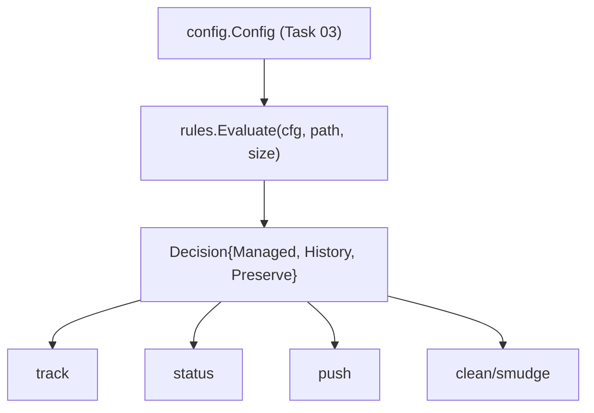

# Task 05: Rule engine — vault-managed decision + effective history/preserve

**Proposal:** [proposal.md](../proposal.md) · **Proposal Section:** Detailed Design → `[rules]` config block; Testing Strategy → Unit (rule engine incl. overrides) · **Block:** 1 (MVP) · **Estimated Effort:** 0.5 day · **Dependencies:** Task 03 (`internal/config` structs + `ParseSize`) · **Type:** Foundation

## Summary

`internal/rules` decides, for a given path + size, whether a file is **vault-managed** and resolves its effective `history` and `preserve` flags. This is the policy core that `track`, `status`, `push`, the `clean` filter, and GC all consult so the answer is consistent everywhere. Centralizing it here prevents three subtly-different glob/threshold implementations drifting apart.

The decision logic, per the proposal's rules block: a file is managed if its size is `>= min_size` **OR** it matches an `include` glob, **minus** any `exclude` glob (exclude wins). Then the ordered `[[rules.overrides]]` are scanned **first-match-wins**: the first override whose `match` glob hits sets the effective `history` and `preserve`; otherwise the global `[rules].history` and `preserve=false` apply. Globbing uses `bmatcuk/doublestar/v4` so `**` spans directories (`masters/**`, `**/*.tmp`).

End-state: `rules.Evaluate(cfg, path, size)` returns a `Decision{Managed, History, Preserve}`. Table-driven tests cover the size boundary, include match, exclude precedence, the `masters/**` override (history+preserve), and `**/*.tmp` exclusion. This is the last Foundation task in Block 1's parsing/policy layer.

## Context

### Related packages
- `internal/rules` — this task.
- Depends on: `internal/config` (Task 03) for `Config`, `Override`, `ParseSize`; `github.com/bmatcuk/doublestar/v4`.
- Consumed by: `track` (Task 12), `status` (Task 13), `push` (Task 14), `clean`/`smudge` filter (Task 17), GC (Task 16).

### Architecture context



### Prerequisites
- [ ] Task 03 — `config.Config` with ordered `Overrides`, exported `ParseSize`.
- [ ] Task 02 — module compiles.

## Changes Required

**File:** `go.mod`
**Action:** Add `github.com/bmatcuk/doublestar/v4`.

**File:** `internal/rules/rules.go`
**Action:** Create.
**Purpose:** Evaluate managed-ness + effective flags.

```go
package rules

import (
	"github.com/bmatcuk/doublestar/v4"

	"github.com/Ibtesam-Mahmood/tailvault/internal/config"
)

type Decision struct {
	Managed  bool
	History  bool // effective, after overrides
	Preserve bool // effective, after overrides
}

// Evaluate decides whether path (size bytes) is vault-managed and resolves
// effective history/preserve. Path is the repo-relative slash path.
func Evaluate(cfg *config.Config, path string, size int64) (Decision, error) {
	minSize, err := config.ParseSize(cfg.Rules.MinSize)
	if err != nil {
		return Decision{}, err
	}

	included, err := matchAny(cfg.Rules.Include, path)
	if err != nil {
		return Decision{}, err
	}
	excluded, err := matchAny(cfg.Rules.Exclude, path)
	if err != nil {
		return Decision{}, err
	}

	managed := (size >= minSize || included) && !excluded

	d := Decision{
		Managed:  managed,
		History:  cfg.Rules.History, // global default
		Preserve: false,             // global default
	}
	if !managed {
		return d, nil
	}

	// First-match-wins override.
	for _, o := range cfg.Rules.Overrides {
		ok, err := doublestar.Match(o.Match, path)
		if err != nil {
			return Decision{}, err
		}
		if ok {
			d.History = o.History
			d.Preserve = o.Preserve
			break
		}
	}
	return d, nil
}

func matchAny(globs []string, path string) (bool, error) {
	for _, g := range globs {
		ok, err := doublestar.Match(g, path)
		if err != nil {
			return false, err
		}
		if ok {
			return true, nil
		}
	}
	return false, nil
}
```

**Implementation Notes:**
- Use `doublestar.Match` (pattern-vs-path), not the filesystem-walking variants — the engine is pure given a path+size, with no disk access. Callers supply the size (from `os.Stat` or a pointer's `size` field).
- Paths must be normalized to forward-slash, repo-relative before calling, so globs behave the same on Windows/macOS/Linux. Document this contract; normalization is the caller's job (or add a `filepath.ToSlash` guard).
- `exclude` wins unconditionally — applied as `&& !excluded` after the size-OR-include test, matching the proposal's "min_size OR include, minus exclude."
- Overrides only adjust `history`/`preserve` and only for managed files; an override match does not make an excluded/under-threshold file managed.

**Key Considerations:**
- Boundary is `>=` `min_size` (a file exactly at the threshold is managed) — matches "files >= this are vault-managed."
- First-match-wins means override order in `tailvault.toml` is significant; Task 03 already preserves it as a slice.
- A malformed glob returns an error (surfaces as a config-bucket failure via Task 07), rather than silently not matching.

## Implementation Checklist
- [ ] Add `bmatcuk/doublestar/v4` to `go.mod`.
- [ ] `Decision` struct.
- [ ] `Evaluate`: size `>=` min_size OR include, minus exclude.
- [ ] Effective `history`/`preserve` from global defaults.
- [ ] First-match-wins override resolution (managed files only).
- [ ] `matchAny` helper using `doublestar.Match`.
- [ ] Document the "caller passes slash-normalized repo-relative path" contract.

## Testing Requirements

`internal/rules/rules_test.go`, table-driven. Build a `config.Config` fixture mirroring the proposal (`min_size "5MB"`, include `**/*.pdf` etc., exclude `**/*.tmp`, `drafts/**`, override `masters/** → history+preserve`).

| Case | path | size | Expect |
|---|---|---|---|
| under threshold, no include | `notes.txt` | 1 MB | Managed=false |
| at threshold boundary | `data.bin` | exactly 5*1024*1024 | Managed=true |
| over threshold | `big.bin` | 10 MB | Managed=true |
| include match, small | `art/logo.pdf` | 1 KB | Managed=true (include) |
| exclude wins over include | `scratch/note.tmp` | 50 MB | Managed=false (`**/*.tmp`) |
| exclude dir | `drafts/board.pdf` | 50 MB | Managed=false (`drafts/**`) |
| override history+preserve | `masters/board.pdf` | 50 MB | Managed=true, History=true, Preserve=true |
| managed, no override | `pnp/board.pdf` | 50 MB | Managed=true, History=false (global), Preserve=false |
| first-match-wins | two overrides both matching | first one's flags apply |
| malformed glob | include `[` | error returned |

Fixtures: construct the `Config` in-code or load via Task 03 from a `testdata` TOML.

## Validation Checklist
- [ ] `go build ./...` succeeds.
- [ ] `go test ./...` passes.
- [ ] `go vet ./...` clean.
- [ ] `gofmt -l .` clean.
- [ ] Bump `VERSION` by `+0.0.1` and add a matching `## v<version>` entry to `CHANGELOG.md` in the same commit.

## Acceptance Criteria
- A file `>= min_size` is managed; one below is not (unless included).
- `include` promotes a small file; `exclude` demotes any matching file regardless of size/include.
- `masters/**` override yields `History=true, Preserve=true` on a managed file.
- `**/*.tmp` is excluded even at large sizes.
- Override resolution is first-match-wins and applies only to managed files.

## Related Proposal Sections
- **Detailed Design → `[rules]`** — `min_size`, `include`, `exclude`, `history`, `auto_delete`, and "Per-pattern overrides; first match wins" with the `masters/**` example (`history = true`, `preserve = true`).
- **Testing Strategy → Unit** — "Rule engine: size threshold + include/exclude glob matching (incl. overrides)."

## Notes & Considerations
- **Gotcha:** `doublestar.Match` requires slash paths; passing OS-native backslash paths on Windows silently mismatches. Normalize before calling (or guard inside `Evaluate`).
- **Gotcha:** an override matching a file that is *not* managed must not flip it to managed — overrides only tune flags. The early `if !managed { return }` enforces this.
- **For Next Task:** Task 06 (pointer format) is independent of rules but completes the in-git representation; the rule engine decides *which* files get a pointer in the first place during `clean` (Task 17).
- Prev: [task-04-lock-parse.md](./task-04-lock-parse.md) · Next: [task-06-pointer-format.md](./task-06-pointer-format.md)
