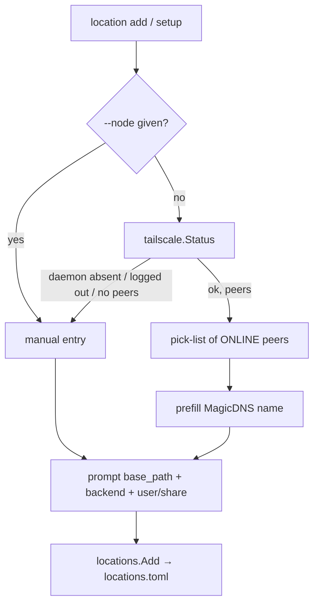

# Task 11: Interactive setup + location add — node discovery from the local Tailscale session

**Proposal:** [proposal.md](../proposal.md) · **Proposal Section:** "Node discovery & location registration (reads the local session)"; Goals; Non-Goals (Q9 — no API/OAuth login in v1) · **Block:** 1 — MVP · **Estimated Effort:** 1 day · **Dependencies:** Task 10 (provides the `locations.toml` registry read/write + `Location` struct), Task 08 (provides the `tailscale.Status()` wrapper + peer fixture) · **Type:** Implementation

## Summary

This task wires the human-facing registration flow. `tailvault setup` and the interactive form of `tailvault location add <name>` enumerate the **online peers** the local machine already sees via `tailscale status --json`, present them as a pick-list, prefill the chosen node's MagicDNS name, then prompt for `base_path` and `backend` (and `user`/`share` per backend), and persist the resulting entry through the Task 10 registry writer into `~/.config/tailvault/locations.toml`.

The flow reads **only the local, already-authenticated Tailscale session** — it never logs into the Tailscale control plane and never stores Tailscale credentials. Per the proposal Non-Goals, an opt-in Tailscale-API discovery mode is explicitly out of scope for v1; here we lean entirely on the local daemon's existing view of the tailnet (the Task 08 wrapper). When the daemon is absent, logged out, or can't enumerate peers, discovery is **skipped** and the flow falls back automatically to manual entry with a clear, single-line message.

Manual entry is also always available explicitly via `--node <magicdns-or-ip>`, which bypasses the pick-list entirely. The end state: a user can register a storage node in under a minute by picking it from a live list, or by typing one flag, with no Tailscale login at any point.

## Context

### Related packages
- `internal/locations` (Task 10) — `Location` struct, `Load()`/`Save()`/`Add()` registry I/O. This task only *uses* it; it does not redefine schema.
- `internal/tailscale` (Task 08) — `Status() (*Status, error)` returning peers with `Online`, `DNSName`, `TailscaleIPs`. This task filters `Online == true`.
- `internal/tserr` (Task 07) — for surfacing `TV-NET-01`/`TV-NET-02` when relevant (informational only here; discovery failure is non-fatal → manual fallback).
- `cmd/tailvault/` — wires `setup` and `location add` Cobra commands (stubbed in Task 02).



### Prerequisites
- [ ] Task 10 merged: `internal/locations` exposes a writer that round-trips the proposal's `locations.toml` schema.
- [ ] Task 08 merged: `internal/tailscale.Status()` + a status JSON fixture with a mix of online/offline peers.
- [ ] A prompt library chosen (see notes): recommend `github.com/charmbracelet/huh`; `github.com/AlecAivazis/survey/v2` is an acceptable alternative.

## Changes Required

**File:** `internal/setup/discover.go`
**Action:** Create.
**Purpose:** Turn a `tailscale.Status` into a sorted list of selectable online peers; decide whether discovery is viable.

```go
package setup

type Peer struct {
    Name string // MagicDNS DNSName, trailing dot trimmed
    IP   string // first TailscaleIP (100.x) as fallback label
}

// OnlinePeers returns online peers from the local session, sorted by Name.
// Returns (nil, false) when the daemon is absent/logged out or yields no peers,
// signalling the caller to fall back to manual entry.
func OnlinePeers(st *tailscale.Status, statusErr error) ([]Peer, bool) {
    if statusErr != nil || st == nil {
        return nil, false
    }
    // filter p.Online; map DNSName→Name (trim trailing "."), pick first TailscaleIP
    // sort by Name; if len == 0 → (nil, false)
}
```

Implementation Notes:
- Trim the trailing `.` from MagicDNS `DNSName`. If `DNSName` is empty, fall back to the first `TailscaleIPs` entry as both `Name` and `IP`.
- This function is **pure** (takes the already-fetched status + its error), so tests need no live daemon.

Key Considerations:
- Do not treat a discovery failure as fatal — it is the trigger for the manual path, per the proposal precondition.

---

**File:** `internal/setup/prompt.go`
**Action:** Create.
**Purpose:** The interactive prompt sequence (pick-list + field prompts), abstracted behind an interface so tests can inject scripted answers.

```go
package setup

type Prompter interface {
    SelectPeer(peers []Peer) (Peer, error)      // pick-list; only when discovery viable
    AskString(label, def string) (string, error)
    AskBackend() (string, error)                 // "ssh" | "taildrive"
}

// BuildLocation runs the flow and returns a locations.Location ready to persist.
// node!="" skips SelectPeer (manual / --node). backend drives whether we ask
// user (ssh) or share (taildrive).
func BuildLocation(p Prompter, peers []Peer, node string) (locations.Location, error)
```

Implementation Notes:
- Default `base_path` suggestion: `/mnt/ssd/tailvault` (matches the proposal sample; nudges users off the boot SD).
- Default `backend`: `ssh` (the locked first backend, per CLAUDE.md).
- For `ssh` prompt `user` (default = `$USER`); for `taildrive` prompt `share`.
- The real `Prompter` impl wraps `huh`/`survey`; keep that impl in a thin file so the logic in `BuildLocation` stays library-agnostic and testable.

Key Considerations:
- `BuildLocation` must be deterministic given scripted answers — no direct I/O in it.

---

**File:** `cmd/tailvault/location.go` (extend), `cmd/tailvault/setup.go`
**Action:** Modify / Create.
**Purpose:** Wire the commands: read `--node`, call `tailscale.Status()`, `OnlinePeers`, `BuildLocation`, then `locations.Add`.

```go
// location add <name> [--node <magicdns-or-ip>]
node, _ := cmd.Flags().GetString("node")
var peers []setup.Peer
if node == "" {
    st, err := tailscale.Status()
    if p, ok := setup.OnlinePeers(st, err); ok {
        peers = p
    } else {
        fmt.Fprintln(os.Stderr, "Tailscale peer discovery unavailable; entering manual mode.")
    }
}
loc, err := setup.BuildLocation(realPrompter{}, peers, node)
// ... locations.Add(name, loc)
```

Implementation Notes:
- `tailvault setup` is the same flow plus (per the CLI surface) a subsequent write of `tailvault.toml` + hook install — but those steps belong to Task 18 (`init`). Here, `setup` performs **location registration** and then **delegates** to the init path; gate the delegation behind a TODO referencing Task 18 if init isn't merged yet, so this task ships standalone.
- The manual-fallback message goes to **stderr**, single line, no stack trace.

Key Considerations:
- Never call any Tailscale login / `up` / API endpoint. Only `tailscale.Status()` (read-only) is permitted (Q9, Non-Goals).

## Implementation Checklist
- [ ] `OnlinePeers` filters online peers, trims MagicDNS dot, sorts, returns `(nil,false)` on failure/empty.
- [ ] `Prompter` interface + `BuildLocation` produce a complete `locations.Location`.
- [ ] Real prompter wraps the chosen lib (`huh`/`survey`) in a thin, swappable file.
- [ ] `location add` honours `--node` (manual) and otherwise attempts discovery.
- [ ] Discovery failure prints a clear single-line stderr message and proceeds to manual entry.
- [ ] `setup` registers the location (delegates init to Task 18 via TODO if needed).
- [ ] No Tailscale login / API / credential storage anywhere in the path.

## Testing Requirements

Go table tests in `internal/setup/*_test.go` with a scripted `Prompter` stub and the Task 08 status fixture.

| Case | Setup | Expect |
|---|---|---|
| Discovery → selection builds entry | fixture with 2 online + 1 offline peer; stub `SelectPeer` picks peer #1 | `Location.node` == peer #1 MagicDNS (dot trimmed); `base_path`/`backend`/`user` from scripted answers |
| Offline peers filtered | fixture peer marked `Online=false` | that peer absent from the pick-list passed to `SelectPeer` |
| Daemon absent → manual path | `OnlinePeers(nil, errDaemonDown)` | returns `(nil,false)`; `BuildLocation` runs without `SelectPeer`, node from manual prompt |
| `--node` bypass | `node="100.92.14.7"` | `SelectPeer` never called; `Location.node == "100.92.14.7"` |
| taildrive backend asks share | scripted `AskBackend()=="taildrive"` | `share` populated, `user` empty |
| ssh backend asks user | scripted `AskBackend()=="ssh"` | `user` populated, `share` empty |

Stubs/fixtures:
- Reuse the **tailscale status fixture from Task 08** (online/offline peer mix).
- A `scriptedPrompter` returning canned answers; assert `SelectPeer` call count to prove the manual/`--node` paths skip it.
- The **stub Backend from Task 09** is not exercised here (no transfer), but `backend` string selection must match its registration keys.

## Validation Checklist
- [ ] `go build ./...`, `go test ./...`, `go vet ./...` pass.
- [ ] `gofmt -l .` reports nothing.
- [ ] Bump `VERSION` by `+0.0.1` and add a matching `## v<version>` entry to `CHANGELOG.md` in the same commit (per CONTRIBUTING.md).

## Acceptance Criteria
- `tailvault location add <name>` with online peers shows a pick-list and writes a correct `locations.toml` entry.
- `--node` and any discovery failure both reach manual entry; the failure prints one clear stderr line.
- No code path performs a Tailscale login, API call, or credential write.
- `tailvault setup` registers a location (init delegation may be a TODO pending Task 18).
- VERSION + CHANGELOG bumped in the same commit.

## Related Proposal Sections
- **Node discovery & location registration** — "enumerate online peers from `tailscale status --json`, let you pick one, prefill its MagicDNS name, then prompt for `base_path` and `backend`… Manual entry is always available as a fallback (`--node <magicdns-or-ip>`)."
- **Node discovery** — "No Tailscale login or API token is involved… it only reads the local daemon's existing view of the tailnet."
- **Non-Goals (v1)** — "Tailscale-API / OAuth login for remote node enumeration… is explicitly out of scope for v1."
- **CLI surface** — `tailvault setup`, `tailvault location add <name>` (`--node` to set manually, omit to pick from the tailnet).

## Notes & Considerations
- **Lib choice:** `charmbracelet/huh` gives a clean multi-field form + select with minimal glue; `survey` is the fallback if a dependency-light build is preferred. Keep it behind the `Prompter` interface so swapping it is a one-file change.
- **Gotcha:** MagicDNS `DNSName` carries a trailing dot — trim it or the SSH backend's host string will be malformed.
- **Gotcha:** Discovery being unavailable is the **normal** path on a logged-out machine; never let it abort the command.
- **For Next Task:** Task 12 (`track`) is the next MVP command; it touches `tailvault.toml`'s rules block rather than `locations.toml`.
- Prev: [task-10-locations-registry.md](./task-10-locations-registry.md) · Next: [task-12-track.md](./task-12-track.md)
