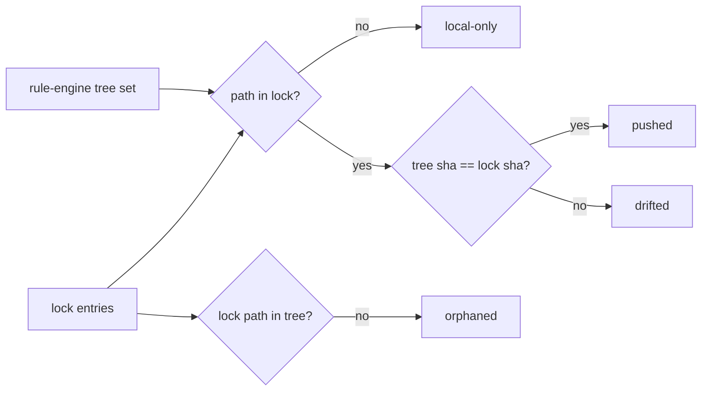

# Task 13: `tailvault status` — classify managed files as local-only / pushed / drifted / orphaned

**Proposal:** [proposal.md](../proposal.md) · **Proposal Section:** CLI surface (`tailvault status` — "local-only / pushed / drifted / orphaned"); Testing Strategy — "Lock diff: detect add / content-diff / move-rename (same sha) / delete" · **Block:** 1 — MVP · **Estimated Effort:** 0.75 day · **Dependencies:** Task 04 (provides `internal/lock` parse + the `Entry` set keyed by path), Task 05 (provides the rule engine to enumerate managed files in the tree), Task 09 (provides the `Backend` interface + stub for optional `Stat` of blob presence) · **Type:** Implementation

## Summary

`tailvault status` gives the user a clean, tabular picture of how the working tree relates to the committed `tailvault.lock`. It enumerates the managed files via the rule engine, hashes each one's current content, and compares against the lock entries keyed by path, sorting every managed path into exactly one of four states:

- **local-only** — file is in the tree and matched by the rules, but has **no** lock entry (a new, never-pushed file).
- **pushed** — the lock entry's `sha256` equals the file's current content hash, and (when backend `Stat` is consulted) the blob is present on the node.
- **drifted** — the file exists and is managed, a lock entry exists, but the tree content hash **differs** from the locked `sha256` (edited since last push).
- **orphaned** — a lock entry exists whose `path` is **not** present in the tree (deleted/moved-away locally).

By default `status` is offline and fast: it compares tree hashes to the lock without touching the node. An optional flag performs a backend `Stat objects/<sha>` to confirm blob presence, which can demote a would-be "pushed" to a missing-blob warning. The output is a stable, sorted table — the at-a-glance answer to "what would `push`/`pull` do?"

## Context

### Related packages
- `internal/lock` (Task 04) — `Load()` → `Lock` with `Entries map[path]Entry` (or sortable slice); each `Entry.SHA256`. Read-only here.
- `internal/rules` (Task 05) — enumerate managed files under the repo root.
- `internal/hash` / `internal/pointer` — content hashing (sha256 of real bytes). If the working file is a *pointer* (not yet smudged), treat per notes below.
- `internal/backend` (Task 09) — optional `Stat(ctx, "objects/"+sha)` for blob-presence. Default off.
- `cmd/tailvault/status.go` — Cobra command (stubbed in Task 02).



### Prerequisites
- [ ] Task 04 merged: lock parses to a path-keyed entry set.
- [ ] Task 05 merged: rule engine enumerates managed files.
- [ ] Task 09 merged: `Backend.Stat` + stub for the optional presence check.

## Changes Required

**File:** `internal/status/status.go`
**Action:** Create.
**Purpose:** Pure classification of a tree set + lock into the four states; the engine of the command.

```go
package status

type State string

const (
    LocalOnly State = "local-only"
    Pushed    State = "pushed"
    Drifted   State = "drifted"
    Orphaned  State = "orphaned"
)

type Row struct {
    Path  string
    State State
    SHA   string // tree sha (local-only/drifted/pushed) or lock sha (orphaned)
}

// Classify compares managed tree files (path→content sha) against lock entries.
// blobPresent is optional: nil skips the presence check; non-nil maps sha→present.
func Classify(treeSHA map[string]string, lock map[string]lock.Entry,
    blobPresent map[string]bool) []Row {
    // local-only: in treeSHA, not in lock
    // pushed:    in both, treeSHA==lock.SHA256 (and blobPresent[sha] if checked)
    // drifted:   in both, treeSHA!=lock.SHA256
    // orphaned:  in lock, not in treeSHA
    // returns rows sorted by Path
}
```

Implementation Notes:
- **Move/rename** falls out naturally: the old path shows **orphaned** and the new path shows **local-only** (same sha). The proposal's "move-rename (same sha)" case is detectable but `status` reports it as the orphaned+local-only pair — `push` (Task 14) is what collapses it to a key-rename with zero transfer. Note this so testers expect two rows, not one.
- When `blobPresent != nil` and a path would be **pushed** but its sha is absent on the node, emit it as `pushed` with a `(blob missing!)` marker column rather than silently — this is the early signal of the `TV-OBJ-01` condition that `pull`/`verify` enforce hard.

Key Considerations:
- `Classify` is pure and backend-free; all I/O (hashing, optional `Stat`) happens in the caller, keeping it trivially table-testable.

---

**File:** `internal/status/scan.go`
**Action:** Create.
**Purpose:** Build the `treeSHA` map by hashing managed files, handling pointer-vs-real-bytes.

```go
// ScanTree hashes each managed file's *content*. If a working file is still a
// pointer (not smudged), use the sha recorded in the pointer rather than
// hashing the pointer text.
func ScanTree(root string, managed []string) (map[string]string, error)
```

Implementation Notes:
- A working file may legitimately be a pointer (eager smudge not yet run). Detect the `tailvault.v1` magic (Task 06 pointer parser) and use its `sha256` — otherwise hashing the pointer bytes would produce a bogus "drifted".

Key Considerations:
- Hashing 1 GB of files is the slow part; stream with `io.Copy` into the hasher, never read whole files into memory.

---

**File:** `cmd/tailvault/status.go`
**Action:** Modify (replace stub).
**Purpose:** Wire load → scan → optional Stat → Classify → table print.

```go
// flags: --check-blobs (optional backend Stat)
cfg := config.Load(root); lk := lock.Load(root)
managed := rules.New(cfg.Rules).WalkMatches(root)
treeSHA := status.ScanTree(root, managed)
var present map[string]bool
if checkBlobs { present = statBlobs(backend, treeSHA, lk) } // Stat objects/<sha>
rows := status.Classify(treeSHA, lk.ByPath(), present)
printTable(rows) // columns: STATE  PATH  SHA(8)
```

Implementation Notes:
- Default `--check-blobs=false` keeps `status` offline and instant; only the explicit flag contacts the node (and then runs the Task 08 preflight first).
- Table: fixed-width columns `STATE  PATH  SHA`, rows sorted by path; truncate sha to 8 hex.

Key Considerations:
- If `--check-blobs` is set and the node is unreachable, surface `TV-NODE-01` (exit 4) rather than printing a half table — but plain `status` (no flag) must succeed even with the node down.

## Implementation Checklist
- [ ] `Classify` returns one row per managed path + per orphaned lock path, correctly bucketed, sorted.
- [ ] `ScanTree` streams hashes and respects pointer files.
- [ ] Optional `--check-blobs` performs backend `Stat` (with preflight) and flags missing blobs.
- [ ] Default `status` is fully offline.
- [ ] Tabular, sorted, greppable output.

## Testing Requirements

Go table tests: `internal/status/status_test.go` with hand-built maps; plus a temp-repo fixture test for `ScanTree`.

| Case | Setup | Expect |
|---|---|---|
| local-only | tree has `new.pdf`; lock empty | row `local-only new.pdf` |
| pushed | tree sha == lock sha for `a.pdf` | row `pushed a.pdf` |
| drifted | lock sha for `a.pdf` ≠ tree sha (content edited) | row `drifted a.pdf` |
| orphaned | lock has `gone.pdf`; not in tree | row `orphaned gone.pdf` |
| move/rename | lock `old.pdf`(sha X); tree `new.pdf`(sha X) | `orphaned old.pdf` **and** `local-only new.pdf` |
| pointer not smudged | working `a.pdf` is a pointer with sha == lock sha | classified `pushed` (uses pointer sha, not pointer-text hash) |
| blob missing (checked) | `--check-blobs`; lock sha present, `blobPresent[sha]==false` | `pushed` row carries `(blob missing!)` marker |
| all four states at once | one file in each state (fixture) | exactly four rows, correctly labelled, sorted |

Fixtures/stubs:
- Reuse the **stub Backend from Task 09** for the `Stat`/presence map (script `Stat` to hit/miss specific shas).
- The **Task 08 tailscale fixture** backs the preflight that runs only under `--check-blobs`.
- A temp repo with files in each state (one new, one matching-lock, one edited, one lock-only) for the end-to-end `Classify` assertion.

## Validation Checklist
- [ ] `go build ./...`, `go test ./...`, `go vet ./...` pass.
- [ ] `gofmt -l .` reports nothing.
- [ ] Bump `VERSION` by `+0.0.1` and add a matching `## v<version>` entry to `CHANGELOG.md` in the same commit (per CONTRIBUTING.md).

## Acceptance Criteria
- Every managed path is classified into exactly one of local-only / pushed / drifted / orphaned (move/rename surfaces as orphaned+local-only).
- Default `status` runs offline; `--check-blobs` adds backend presence and flags missing blobs.
- Output is a stable, sorted table.
- VERSION + CHANGELOG bumped in the same commit.

## Related Proposal Sections
- **CLI surface** — "`tailvault status` — local-only / pushed / drifted / orphaned".
- **Testing Strategy → Unit** — "Lock diff: detect add / content-diff / move-rename (same sha) / delete."

## Notes & Considerations
- **Gotcha:** a pointer-only working file must be hashed via its recorded sha, not its text bytes — otherwise everything reads as `drifted`.
- **Gotcha:** move/rename is two rows in `status`; it is `push` that recognises the shared sha and renames the lock key with zero transfer.
- **For Next Task:** Task 14 (`push`) reuses `ScanTree` and the same hash-vs-lock comparison, then acts on it (Stat/Put/lock-update) — keep `ScanTree` and `Classify` reusable.
- Prev: [task-12-track.md](./task-12-track.md) · Next: [task-14-push.md](./task-14-push.md)
