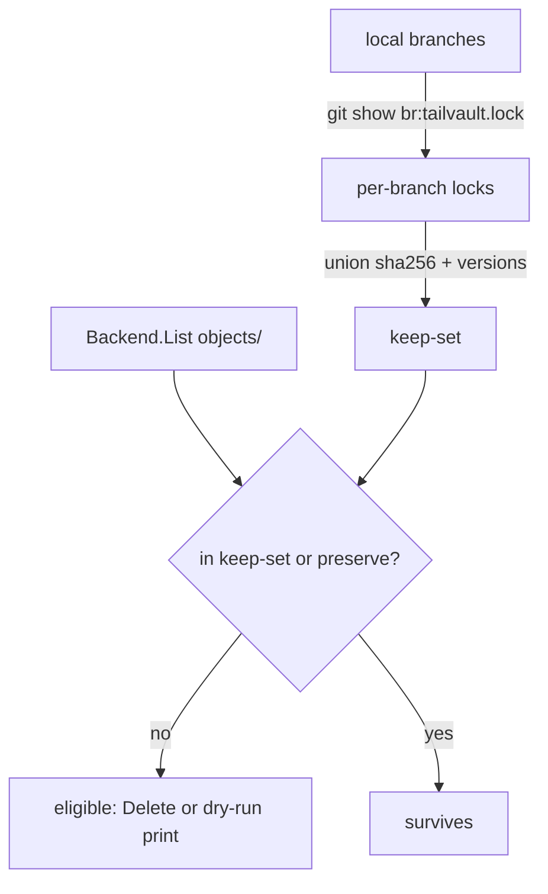

# Task 16: GC & Per-Branch Retention

**Proposal:** [proposal.md](../proposal.md) · **Proposal Section:** Detailed Design → "GC / per-branch retention (proposed resolution of Open Q1)"; Push flow; Open Questions → Q4; Risk Assessment ("GC deletes a blob another branch/remote needs"); Testing Strategy → "Per-branch GC" · **Block:** 1 — MVP · **Estimated Effort:** 1.5 ideal eng-days · **Dependencies:** Task 14 (push — provides delete detection, the `Mark` step, and the `Backend.List/Delete` calls); Task 04 (lock parse — provides the `tailvault.lock` schema: `sha256`, `versions[]`, `preserve`, `auto_delete`) · **Type:** Implementation

## Summary

`internal/gc` implements the retention half of tailvault's anti-bloat promise:
unreferenced blobs on the storage node get pruned. Per Q4, the split is **mark on
push, sweep on explicit `gc`** — `push` (Task 14) records delete intent (feeds
`auto_delete`, honours `preserve`), and `tailvault gc [--dry-run]` performs the
actual mark-and-sweep over `objects/`.

The sweep is **per-branch mark-and-sweep** exactly as the proposal specifies: the
**keep-set is the UNION of every local branch's committed `tailvault.lock`** —
each branch tip's lock contributes its entries' `sha256` plus, for history-on
entries, every sha in `versions[]`. A blob in `objects/<sha>` that is in **no**
branch's keep-set and is **not** marked `preserve` is eligible for deletion. This
makes "a delete on branch A must not nuke a blob branch B still references" fall
out naturally — branch B's lock keeps the sha in the union.

`--dry-run` lists exactly what *would* be removed and deletes nothing. The real
sweep calls `Backend.Delete` on each eligible blob.

## Context

### Related packages

- `internal/gc` — **created here.** `KeepSet`, `Plan`, `Sweep`, command wiring.
- `internal/lock` (Task 04) — parse each branch's `tailvault.lock`; read
  `sha256`, `versions[]`, `preserve`.
- `internal/gitglue` (Task 02/19) — enumerate local branches and read a file at a
  branch tip (`git for-each-ref`, `git show <branch>:tailvault.lock`).
- `internal/backend` (Task 09) — `List("objects/")` to enumerate stored blobs;
  `Delete` to prune. Reuse the **stub Backend from Task 09** in tests.
- `cmd/tailvault` — registers `tailvault gc [--dry-run]`.



### Prerequisites

- [ ] Task 14 merged: `push` writes/marks lock state and resolves the backend.
- [ ] Task 04 merged: lock schema with `sha256`, `versions[]`, `preserve`.
- [ ] Confirm Q4 resolution: mark on push, sweep on explicit `gc` only.

## Changes Required

### internal/gc/gc.go

- **File:** `internal/gc/gc.go`
- **Action:** create
- **Purpose:** build the per-branch keep-set, diff it against stored blobs, and
  sweep (or dry-run) the eligibles.

```go
package gc

// KeepSet is the union of shas referenced by any local branch's committed lock,
// plus shas of entries marked preserve (defensive — preserve blobs are never
// eligible even if somehow absent from a tip).
type KeepSet map[string]struct{}

// Plan is the result of a mark step: blobs that would be deleted vs kept.
type Plan struct {
    Eligible []string // sha keys (objects/<sha>) with no branch ref and no preserve
    Kept     int
    Preserved int
}

// BuildKeepSet reads each local branch tip's tailvault.lock and unions
// every entry.SHA256 and (for history-on entries) every sha in entry.Versions.
func BuildKeepSet(branchLocks map[string]lock.File) KeepSet { /* ... */ }

// PlanSweep lists blobs in objects/ that are in no branch's keep-set and are not
// preserve. preserveShas is the set of shas that any branch marks preserve.
func PlanSweep(stored []string, keep KeepSet, preserveShas KeepSet) Plan { /* ... */ }

// Sweep deletes Plan.Eligible via the backend unless dryRun is set.
func Sweep(ctx context.Context, b backend.Backend, p Plan, dryRun bool) error { /* ... */ }
```

Notes:

- `BuildKeepSet` takes already-parsed per-branch locks so it is pure and easily
  table-tested; the command layer does the `git show <branch>:tailvault.lock`
  reads and tolerates branches with **no** lock (skip, contribute nothing).
- A blob is kept if its sha is in the union OR is `preserve`. `preserve` is
  belt-and-braces: an entry marked `preserve` on any branch protects its sha
  regardless of keep-set membership.
- `objects/<sha>` keys from `Backend.List("objects/")` are stripped to bare sha
  for set comparison.

Key Considerations:

- **Never** delete a sha present in any branch's union — this is the core Risk
  Assessment mitigation ("GC deletes a blob another branch needs").
- Sweep is the only command that calls `Delete`; `push` only *marks* (Q4). Do not
  auto-sweep inside `push`.
- Hard-fail preflight (reuse the push preflight): if the node is unreachable,
  abort before listing/deleting so a down node never yields a partial sweep.

### cmd/tailvault/gc.go

- **File:** `cmd/tailvault/gc.go`
- **Action:** create
- **Purpose:** wire `tailvault gc [--dry-run]`: load config, resolve backend,
  enumerate branches, build keep-set, plan, print, and (unless `--dry-run`) sweep.

Notes:

- `--dry-run` prints each eligible `objects/<sha>` with its size (from `Stat` or
  the lock) and a summary line; exit 0, delete nothing.
- Without `--dry-run`, print the same plan, then `Sweep`, then a deleted count.

## Implementation Checklist

- [ ] `KeepSet` = union of `sha256` + `versions[]` across all branch locks.
- [ ] `preserve` shas always survive (per-branch, defensively).
- [ ] `PlanSweep` marks only blobs absent from union and not preserve.
- [ ] `Sweep` deletes via `Backend.Delete`; `--dry-run` deletes nothing.
- [ ] Command enumerates **all** local branches and reads each tip's lock.
- [ ] Preflight node reachability before any list/delete.

## Testing Requirements

`internal/gc/gc_test.go` — table-driven, using the **stub Backend from Task 09**
seeded with `objects/<sha>` keys and in-memory `lock.File` values per branch:

- **Delete prunes blob:** branch `main` lock drops a file (sha no longer in any
  lock) → `PlanSweep` lists that sha as eligible; `Sweep` calls `Delete` once.
- **`preserve` survives:** a deleted file whose entry is `preserve` → not
  eligible, no `Delete`.
- **Cross-branch survival:** sha removed from branch A's lock but still in branch
  B's lock → union keeps it → not eligible (the headline Risk case).
- **History versions kept:** a history-on entry's `versions[]` shas are all in the
  keep-set → none eligible (overlaps Task 20).
- **`--dry-run`:** eligible list is identical but zero `Delete` calls recorded on
  the stub.
- **Empty / no-lock branch:** a branch with no `tailvault.lock` contributes
  nothing and does not panic.

## Validation Checklist

- [ ] `go build ./...` succeeds.
- [ ] `go test ./...` passes.
- [ ] `go vet ./...` clean.
- [ ] `gofmt -l .` reports nothing.
- [ ] Bump `VERSION` by `+0.0.1` and add a matching `## v<version>` entry to the
  top of `CHANGELOG.md` **in the same commit**.

## Acceptance Criteria

- The keep-set is the union of `sha256` and history `versions[]` across **every**
  local branch's committed `tailvault.lock`.
- A blob in no branch's keep-set and not `preserve` is the only thing `Sweep`
  deletes.
- A blob still referenced by another branch survives a delete elsewhere.
- `--dry-run` lists eligibles and performs no deletion.

## Related Proposal Sections

> **GC / per-branch retention (proposed resolution of Open Q1):** Mark-and-sweep
> keyed on **every local branch's committed `tailvault.lock`**: the keep-set is
> the union of `sha256` (and `versions[]` for history-on entries) across all
> branch tips. A blob in `objects/` that is in no branch's keep-set and carries
> no `preserve` is eligible for deletion. … `--dry-run` lists what would be
> removed.

> **Q4 — GC trigger.** … **mark on push, sweep on explicit `gc` (with
> `--dry-run`)** — safer, avoids surprise deletes mid-push.

> **Risk:** GC deletes a blob another branch/remote needs … *Mitigation:*
> Mark-and-sweep across **all** branch locks + `--dry-run`; never delete
> `preserve`.

## Notes & Considerations

- **Gotcha:** read locks from **branch tips**, not just the working tree — an
  uncommitted lock change must not influence GC.
- **Gotcha:** `versions[]` only exists on history-on entries; absent → treat as
  empty, not an error.
- **For Next Task:** Task 20 (history/refs) extends the keep-set contract by
  populating `versions[]`; this task already unions them, so history just works.
- **Prev:** [task-15-pull](./task-15-pull.md) ·
  **Next:** [task-17-clean-smudge-filter](./task-17-clean-smudge-filter.md)
