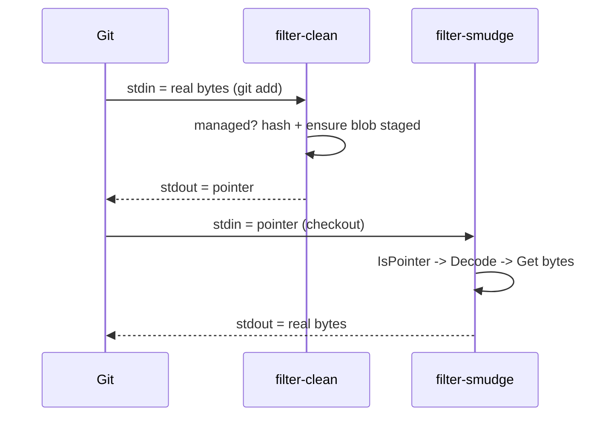

# Task 17: clean / smudge Filter Driver

**Proposal:** [proposal.md](../proposal.md) · **Proposal Section:** Proposed Solution → Overview ("git glue (a `clean`/`smudge` filter …)"); Detailed Design → "Pointer file (the in-git stand-in)"; Open Questions → Q6 · **Block:** 1 — MVP · **Estimated Effort:** 1.5 ideal eng-days · **Dependencies:** Task 06 (pointer codec — `Encode`/`Decode`/`IsPointer`); Task 14 (push — ensures the blob is known/staged, resolves backend, hashing); Task 15 (pull — the `Get` fetch path used by smudge) · **Type:** Integration

## Summary

This is the git filter driver — the two hidden subcommands that `.gitattributes`
`filter=tailvault` invokes for every managed file. Git pipes file bytes through
them on staging and checkout:

- `tailvault filter-clean` — **stdin = raw file bytes** (git runs this on `git
  add`/commit). If the file's path is vault-managed (rules from Task 05/config),
  hash the content, ensure the blob is known/staged for the next `push`, and emit
  the **pointer** (Task 06 `Encode`) to **stdout**. If the path is *not*
  vault-managed, pass the bytes straight through unchanged.
- `tailvault filter-smudge` — **stdin = a pointer OR raw bytes** (git runs this on
  checkout). If stdin `IsPointer`, `Decode` it and fetch the real bytes via the
  pull/`Get` path (Task 15), emitting them to stdout. Otherwise pass bytes
  through untouched.

These subcommands are the mechanical translation layer; they own no policy beyond
"is this a pointer / is this path managed." Per Q6 (eager v1), smudge fetches
inline. The round-trip `clean → pointer → smudge → original bytes` must be exact.

## Context

### Related packages

- `internal/filter` — **created here.** `Clean(ctx, path, in, out)` and
  `Smudge(ctx, in, out)` as testable `io.Reader`/`io.Writer` functions.
- `internal/pointer` (Task 06) — `Encode` in clean, `Decode`/`IsPointer` in
  smudge. The canonical bytes contract.
- `internal/rules` (Task 05) + `internal/config` (Task 03) — decide whether
  `%f` (the file path git passes) is vault-managed in clean.
- `internal/backend` (Task 09) + pull `Get` (Task 15) — fetch blob bytes in
  smudge. Reuse the **stub Backend from Task 09** in tests.
- `cmd/tailvault` — registers hidden `filter-clean` / `filter-smudge` commands
  (`Hidden: true`), each taking the git-supplied path via `%f`.



### Prerequisites

- [ ] Task 06 merged: pointer `Encode`/`Decode`/`IsPointer`.
- [ ] Task 14/15 merged: push staging + pull `Get` fetch path.
- [ ] Confirm `.gitattributes` invocation passes the path via `%f` (Task 18 wires
      `git config filter.tailvault.clean = "tailvault filter-clean %f"`).

## Changes Required

### internal/filter/filter.go

- **File:** `internal/filter/filter.go`
- **Action:** create
- **Purpose:** the pure clean/smudge transforms, decoupled from os.Stdin/Stdout.

```go
package filter

// Clean reads the real file bytes from in. If path is vault-managed per cfg/rules,
// it hashes the content, records the blob so push will upload it, and writes the
// pointer to out. Otherwise it copies in -> out verbatim.
func Clean(ctx context.Context, env *Env, path string, in io.Reader, out io.Writer) error

// Smudge reads stdin from in. If the bytes are a pointer, it decodes it and
// fetches the real content via the backend Get path, writing bytes to out.
// Otherwise it copies in -> out verbatim.
func Smudge(ctx context.Context, env *Env, in io.Reader, out io.Writer) error
```

Notes:

- **clean, non-managed:** stream-copy `in → out` (e.g. `io.Copy`); never alter
  bytes git did not ask us to manage.
- **clean, managed:** read fully (need the whole content to hash sha256), compute
  `sha`+`size`, ensure the blob is known/staged for `push` (write to a local
  staging cache / index the engine reads, or rely on `push` re-scanning — pick
  one and document; the proposal's push re-scans the tree, so clean's primary job
  is emitting the pointer). Emit `pointer.Encode({sha, size, location})`.
- **smudge, pointer:** `pointer.Decode` → fetch `objects/<sha>` via the Task 15
  `Get` path → stream to `out`. Verify fetched size/sha matches the pointer
  (integrity); surface `TV-OBJ-01` if the blob is missing.
- **smudge, non-pointer:** `IsPointer` false → copy through (covers a not-yet-
  cleaned file or a small file that was never managed).

Key Considerations:

- Filters must be **byte-exact** and **panic-free on arbitrary binary** (real
  PDFs/STLs). `IsPointer` (Task 06) is the cheap guard.
- A filter that errors must exit non-zero so git aborts the operation rather than
  committing a half-written file.
- Location for the pointer comes from `cfg.storage.location`; sha/size from the
  content.

### cmd/tailvault/filter.go

- **File:** `cmd/tailvault/filter.go`
- **Action:** create
- **Purpose:** hidden `filter-clean %f` / `filter-smudge %f` commands wiring
  `os.Stdin`/`os.Stdout` to `filter.Clean`/`filter.Smudge`, mapping errors through
  `tserr` exit codes.

Notes:

- Both commands are `Hidden: true` (invoked by git, not humans).
- The path argument is the git `%f` placeholder; clean uses it for the rule
  check, smudge ignores it (pointer carries everything).

## Implementation Checklist

- [ ] `filter-clean`: managed path → emit pointer; unmanaged → pass through.
- [ ] `filter-clean`: hashes content, stages blob for push.
- [ ] `filter-smudge`: pointer → fetch real bytes via `Get`; else pass through.
- [ ] `filter-smudge`: integrity-check fetched bytes against pointer sha/size.
- [ ] Both commands hidden; wired to stdin/stdout; tserr exit mapping.
- [ ] Byte-exact, panic-free on binary input.

## Testing Requirements

`internal/filter/filter_test.go` — table-driven, **stub Backend from Task 09**:

- **Full round-trip:** managed path: `Clean(bytes)` → pointer; feed that pointer
  to `Smudge` (stub `Get` returns the original bytes) → output equals the
  original bytes exactly.
- **Non-managed pass-through (clean):** path excluded by rules → `Clean` output
  == input bytes verbatim (incl. binary `\xFF\xD8\xFF…`).
- **Non-pointer pass-through (smudge):** stdin is random/binary bytes (not a
  pointer) → `Smudge` output == input verbatim.
- **Smudge missing blob:** pointer references a sha the stub doesn't have → error
  mapped to `TV-OBJ-01` / non-zero exit.
- **Integrity mismatch:** stub returns bytes whose sha ≠ pointer sha → error.

## Validation Checklist

- [ ] `go build ./...` succeeds.
- [ ] `go test ./...` passes.
- [ ] `go vet ./...` clean.
- [ ] `gofmt -l .` reports nothing.
- [ ] Bump `VERSION` by `+0.0.1` and add a matching `## v<version>` entry to the
  top of `CHANGELOG.md` **in the same commit**.

## Acceptance Criteria

- `clean → pointer → smudge` reproduces the original bytes byte-for-byte for
  managed files.
- Non-managed bytes (clean) and non-pointer bytes (smudge) pass through
  untouched.
- A smudge against a missing/corrupt blob fails with a typed error and non-zero
  exit (git aborts the checkout) rather than writing wrong bytes.

## Related Proposal Sections

> A Go CLI (`tailvault`) wraps … (3) git glue (a `clean`/`smudge` filter +
> `pre-push`/`post-merge`/`post-checkout` hooks).

> The `clean` filter replaces a large file's bytes with [the pointer] on commit;
> `smudge` restores real bytes on checkout.

> **Q6 — Pointer resolution on checkout.** … **Recommend: eager for v1, lazy as a
> later option.**

## Notes & Considerations

- **Gotcha:** keep the transforms in `internal/filter` as `io.Reader`/`Writer`
  functions so they're unit-testable without spawning git.
- **Gotcha:** clean must read the whole stream before emitting (sha needs all
  bytes); don't try to stream-hash-and-forward as a pointer.
- **For Next Task:** Task 18 (`init`) registers
  `filter.tailvault.clean/smudge/required` git config and the `.gitattributes`
  `filter=tailvault` line that invoke these commands.
- **Prev:** [task-16-gc-retention](./task-16-gc-retention.md) ·
  **Next:** [task-18-init](./task-18-init.md)
