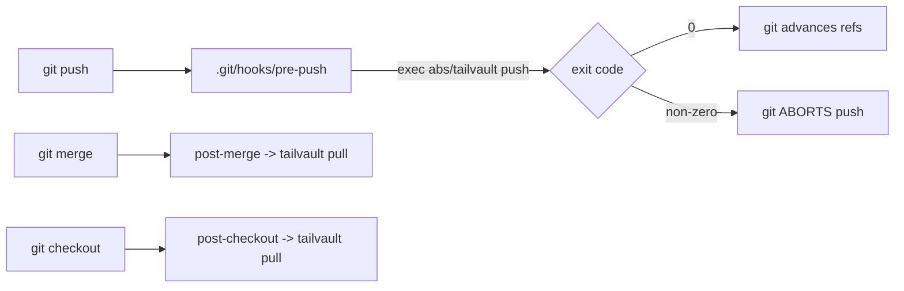

# Task 19: Git Hooks (pre-push / post-merge / post-checkout)

**Proposal:** [proposal.md](../proposal.md) · **Proposal Section:** Proposed Solution → Overview ("`pre-push`/`post-merge`/`post-checkout` hooks"); Push flow (hook invokes `push`; "exit 1 (push ABORTS)"); Error model → bucketed exit codes ("The `pre-push` hook surfaces the same code") · **Block:** 1 — MVP · **Estimated Effort:** 1 ideal eng-day · **Dependencies:** Task 14 (push — `pre-push` runs it and forwards its exit code); Task 15 (pull — `post-merge`/`post-checkout` run it); Task 18 (init — calls `InstallHooks`; supplies repo root + binary path) · **Type:** Integration

## Summary

`internal/hooks` installs and defines the three git hooks that bind tailvault to
`git push`/`pull`:

- **`pre-push`** runs `tailvault push` and **propagates its exit code**. A failed
  push (node down, missing blob) returns non-zero → git **aborts the push** before
  refs advance, and the failure surfaces the same `tserr` exit bucket (3 net / 4
  node / 5 integrity) so the user sees a legible cause, not a generic git error.
  This is the core "green push = bytes landed" guarantee.
- **`post-merge`** runs `tailvault pull` to fetch blobs the merged tree now needs.
- **`post-checkout`** runs `tailvault pull` to fetch blobs for the checked-out
  tree (eager, per Q6).

Hook scripts invoke tailvault by the **absolute path** to the binary (resolved at
install time by Task 18), so they work regardless of the user's `PATH` when git
runs them. `InstallHooks(repoRoot, binPath)` writes the three executable scripts
into `.git/hooks/` and is called by `init` (Task 18).

## Context

### Related packages

- `internal/hooks` — **created here.** `InstallHooks(repoRoot, binPath)` + the
  embedded hook script templates.
- `cmd/tailvault/init.go` (Task 18) — calls `InstallHooks` with the resolved
  repo root and `os.Executable()` path.
- `tailvault push` (Task 14) / `tailvault pull` (Task 15) — the commands the
  hooks invoke; their exit codes are what `pre-push` forwards.
- `internal/tserr` (Task 07) — the exit-code buckets the hook surfaces.



### Prerequisites

- [ ] Task 14/15 merged: `push` and `pull` commands with `tserr` exit buckets.
- [ ] Task 18 will call `InstallHooks`; agree the `(repoRoot, binPath string)`
      signature.
- [ ] Confirm hook dir = `.git/hooks` (handle `core.hooksPath` if set — see Notes).

## Changes Required

### internal/hooks/hooks.go

- **File:** `internal/hooks/hooks.go`
- **Action:** create
- **Purpose:** render and install the three hook scripts; expose `InstallHooks`.

```go
package hooks

// InstallHooks writes pre-push, post-merge, post-checkout into the repo's hooks
// dir (.git/hooks, honouring core.hooksPath), each executable (0o755), each
// invoking the absolute tailvault binary path.
func InstallHooks(repoRoot, binPath string) error { /* ... */ }

// Hook script bodies (templated with binPath). pre-push forwards the exit code:
//   #!/bin/sh
//   exec "<binPath>" push
// post-merge / post-checkout:
//   #!/bin/sh
//   "<binPath>" pull || exit $?
```

Notes:

- **`pre-push` must forward the exit code.** Using `exec "<bin>" push` replaces
  the shell with tailvault so its exit status *is* the hook's status → git aborts
  on non-zero. (Equivalently `"<bin>" push; exit $?`.)
- **`post-checkout`** receives three args from git (`$1 $2 $3`); branch checkouts
  set `$3=1`. v1 (eager, Q6) can simply run `pull` on any checkout; optionally
  guard on `$3=1` to skip file checkouts. Document the choice.
- **`core.hooksPath`:** if the repo sets it, install there; otherwise
  `.git/hooks`. Resolve via `git rev-parse --git-path hooks`.
- **Idempotent / overwrite:** always (re)write the scripts with the current
  `binPath` (an upgrade may move the binary); set mode `0o755`.
- **Existing user hooks:** if a non-tailvault hook already exists, do not silently
  clobber — append/chain or write a clearly-marked tailvault hook and warn. v1
  may overwrite but must emit a warning; document the behavior.

Key Considerations:

- Scripts are POSIX `sh`, not bash — keep them minimal and portable
  (darwin/linux).
- Quote `<binPath>` to tolerate spaces in the path.
- Hooks themselves do **no** preflight — they just call tailvault, which
  preflights and returns the right bucketed code.

## Implementation Checklist

- [ ] `InstallHooks` writes `pre-push`, `post-merge`, `post-checkout`.
- [ ] All three are mode `0o755` (executable).
- [ ] Each invokes the **absolute** `binPath`.
- [ ] `pre-push` forwards tailvault push's exit code (git aborts on non-zero).
- [ ] `post-merge` / `post-checkout` run `tailvault pull`.
- [ ] Honours `core.hooksPath`; warns before overwriting a foreign hook.

## Testing Requirements

`internal/hooks/hooks_test.go` — against a `t.TempDir()` `git init` repo:

- **Installed + executable:** after `InstallHooks`, all three files exist in the
  hooks dir with the executable bit set (`fi.Mode()&0o111 != 0`).
- **Absolute path embedded:** each script body contains the exact `binPath`
  passed in.
- **pre-push forwards non-zero:** point `binPath` at a tiny stub script that
  exits 4; run the installed `pre-push`; assert it exits 4 (not 0). (Covers the
  "failed push aborts" contract via exit-code forwarding.)
- **post-merge/checkout invoke pull:** point `binPath` at a stub that records its
  argv; run the installed `post-merge` and `post-checkout`; assert each invoked
  the stub with `pull`.
- **Re-install:** running `InstallHooks` twice leaves valid, executable scripts
  (idempotent).

## Validation Checklist

- [ ] `go build ./...` succeeds.
- [ ] `go test ./...` passes.
- [ ] `go vet ./...` clean.
- [ ] `gofmt -l .` reports nothing.
- [ ] Bump `VERSION` by `+0.0.1` and add a matching `## v<version>` entry to the
  top of `CHANGELOG.md` **in the same commit**.

## Acceptance Criteria

- The three hook files are installed, executable, and invoke tailvault by
  absolute path.
- A `tailvault push` that exits non-zero causes the `pre-push` hook to exit with
  the same code, aborting the git push.
- `post-merge` and `post-checkout` invoke `tailvault pull`.

## Related Proposal Sections

> … git glue (a `clean`/`smudge` filter + `pre-push`/`post-merge`/`post-checkout`
> hooks).

> **Push flow:** `G->>TV: invoke with pushed refs` … `TV-->>G: exit 1 (push
> ABORTS)` … `TV-->>G: exit 0 -> git proceeds to push refs`.

> **Error model:** The `pre-push` hook surfaces the same code so a failed push
> reads obviously rather than as a generic git error.

## Notes & Considerations

- **Gotcha:** `exec` (or `; exit $?`) is mandatory in `pre-push` — a bare
  `tailvault push` without forwarding would let a failed push silently succeed.
- **Gotcha:** resolve the hooks dir via `git rev-parse --git-path hooks` so
  worktrees and `core.hooksPath` are handled.
- **For Next Task:** Task 20 (history/refs) doesn't touch hooks, but a future
  lazy-fetch (Q6) would change the `post-checkout` body — keep it isolated.
- **Prev:** [task-18-init](./task-18-init.md) ·
  **Next:** [task-20-history-refs](./task-20-history-refs.md)
