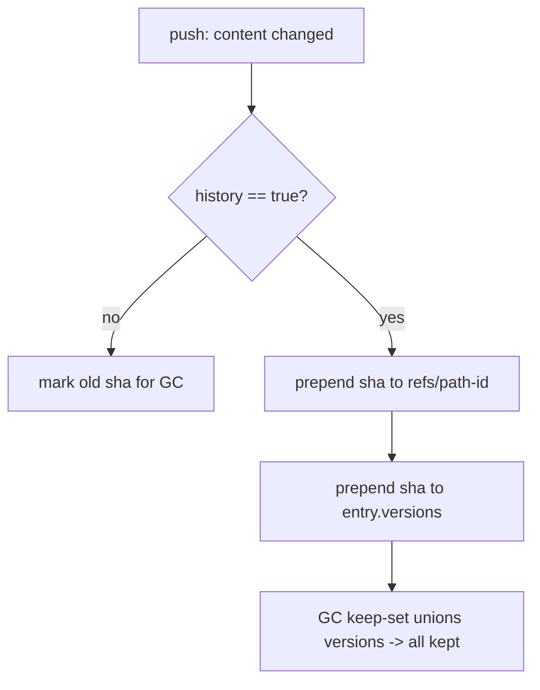

# Task 20: Opt-in History & `refs/<path-id>`

**Proposal:** [proposal.md](../proposal.md) · **Proposal Section:** Storage layout on the node (`refs/<path-id>` — "history-on files only: newest-first list of shas"); `tailvault.lock` (`versions = [...]`); Implementation Plan → Phase 6 ("Opt-in `history`; `refs/<path-id>`; `revert`"); GC keep-set ("union of `sha256` (and `versions[]` …)"); Appendix → Glossary ("**path-id:** a stable hash of a file's logical path") · **Block:** 2 — Hardening & extras · **Estimated Effort:** 1 ideal eng-day · **Dependencies:** Task 14 (push — the flow this extends: when content changes, append the new sha); Task 16 (GC — already unions `versions[]` into the keep-set, so history versions are exempt from auto_delete/GC) · **Type:** Implementation

## Summary

Opt-in version history. When a file or pattern resolves to `history = true` (rule
or per-pattern override), a content change during `push` does two extra things
beyond the history-off path:

1. **Append the new sha to `refs/<path-id>` on the node**, newest-first — the
   node-side append-only version log for that logical path.
2. **Append the new sha to the lock entry's `versions[]`**, newest-first — the
   committed, per-clone record.

Because superseded versions live in `versions[]` (and `refs/<path-id>`), they are
**exempt from auto_delete and GC**: Task 16's keep-set already unions `versions[]`
across all branch locks, so every retained version survives the sweep. (Contrast
history-off, where push marks the old sha for GC.)

`path-id` is a **stable hash of the file's logical path** (the glossary
definition) — so renames key history correctly and the same path always maps to
the same ref. History-off files have no `versions[]` and no `refs/` entry (the
anti-bloat default).

## Context

### Related packages

- `internal/history` (or fold into `internal/lock` + push) — **created/extended
  here.** `PathID(path)`, the `refs/<path-id>` append, and `versions[]`
  maintenance.
- `internal/lock` (Task 04) — `versions []string` field (newest-first) on history
  entries.
- `tailvault push` (Task 14) — branch: on content change, history-on → append;
  history-off → mark old sha for GC.
- `internal/backend` (Task 09) — `Get`/`Put` `refs/<path-id>` (read newest-first
  list, prepend, write). Reuse the **stub Backend from Task 09** in tests.
- `internal/gc` (Task 16) — already unions `versions[]`; no change needed, only
  verified by test.



### Prerequisites

- [ ] Task 14 merged: push content-change detection + lock write.
- [ ] Task 16 merged: GC keep-set unions `versions[]`.
- [ ] Task 04's lock schema includes `versions []string`.
- [ ] Confirm `path-id` = stable hash of the logical path (glossary).

## Changes Required

### internal/history/history.go

- **File:** `internal/history/history.go`
- **Action:** create
- **Purpose:** `PathID` and the node-side `refs/<path-id>` append.

```go
package history

// PathID returns a stable, filesystem-safe id for a file's logical path,
// per the glossary ("a stable hash of a file's logical path"). e.g. hex
// sha256 of the cleaned, slash-normalized repo-relative path.
func PathID(logicalPath string) string { /* sha256 of normalized path, hex */ }

// AppendVersion prepends sha (newest-first) to refs/<path-id> on the backend,
// reading the existing newline-delimited list, deduping if sha is already head,
// and writing it back. Returns the full version list (newest-first).
func AppendVersion(ctx context.Context, b backend.Backend, pathID, sha string) ([]string, error)
```

Notes:

- `refs/<path-id>` is a **newest-first**, newline-delimited list of shas. Append =
  prepend the new sha (skip if it already equals head — re-push of same content
  is a no-op).
- `PathID` must be **stable** and path-only (don't include content) — the glossary
  is explicit. Normalize separators to `/` and clean the path before hashing.

### push integration (cmd/tailvault/push.go — Task 14)

- **File:** `cmd/tailvault/push.go`
- **Action:** modify
- **Purpose:** branch the content-change path on `history`.

```go
// on a content change for entry e:
if e.History {
    versions, _ := history.AppendVersion(ctx, b, history.PathID(e.Path), newSHA)
    e.Versions = versions            // newest-first, includes newSHA at head
    // do NOT mark the superseded sha for GC — versions[] keeps it.
} else {
    markForGC(e.SHA256)              // existing history-off behavior
    e.Versions = nil
}
e.SHA256 = newSHA
```

Key Considerations:

- Superseded versions are **never** marked for GC when `history` is on — they live
  in `versions[]` and the node's `refs/<path-id>`, both inside the keep-set.
- `Put objects/<newSHA>` still dedups on `Stat` as usual; only the ref/versions
  bookkeeping is added.
- Newest-first ordering is the contract Task 21 (`revert`) and `refs/` readers
  depend on — keep it consistent between `versions[]` and `refs/<path-id>`.

## Implementation Checklist

- [ ] `PathID` = stable hash of the normalized logical path (content-independent).
- [ ] `AppendVersion` prepends sha to `refs/<path-id>`, newest-first, dedup head.
- [ ] push: history-on content change appends to `refs/` and `versions[]`.
- [ ] push: history-on superseded shas are **not** marked for GC.
- [ ] history-off behavior unchanged (no `versions[]`, old sha marked for GC).

## Testing Requirements

Tests using the **stub Backend from Task 09**:

`internal/history/history_test.go`:

- **Stable path-id:** `PathID("a/b.pdf") == PathID("a/b.pdf")` and
  `PathID("./a/b.pdf")` (normalized) equals it; differs for a different path.
- **Newest-first append:** three sequential `AppendVersion` calls →
  `refs/<path-id>` reads `[v3, v2, v1]`; re-appending `v3` is a no-op.

Push/GC integration test:

- **Three versions retained:** enable `history = true`; push the same file with
  three different contents → entry `versions[]` has all 3 shas (newest-first) and
  `refs/<path-id>` lists all 3.
- **GC keeps all history versions:** run Task 16's `PlanSweep` with that branch's
  lock → none of the 3 shas are eligible (all in the keep-set via `versions[]`).
- **History-off contrast:** same sequence with `history = false` → only current
  sha kept; superseded shas marked for GC and eligible for sweep.

## Validation Checklist

- [ ] `go build ./...` succeeds.
- [ ] `go test ./...` passes.
- [ ] `go vet ./...` clean.
- [ ] `gofmt -l .` reports nothing.
- [ ] Bump `VERSION` by `+0.0.1` and add a matching `## v<version>` entry to the
  top of `CHANGELOG.md` **in the same commit**.

## Acceptance Criteria

- Enabling `history` and pushing three versions retains all three shas in both
  `refs/<path-id>` (newest-first) and the lock entry's `versions[]`.
- GC keeps all history versions (none eligible for sweep).
- History-off files retain only the current sha; superseded blobs become
  GC-eligible.
- `path-id` is a stable, content-independent hash of the logical path.

## Related Proposal Sections

> `refs/<path-id>       # history-on files only: newest-first list of shas`

> `# history-on entries additionally carry, newest-first:`
> `# versions = ["9f2b1c…", "7c10aa…"]`

> **Phase 6 — History / revert:** Opt-in `history`; `refs/<path-id>`; `revert`.

> **GC keep-set:** the union of `sha256` (and `versions[]` for history-on
> entries) across all branch tips.

> **Glossary — path-id:** a stable hash of a file's logical path, used to key
> history refs.

## Notes & Considerations

- **Gotcha:** keep `versions[]` and `refs/<path-id>` in the **same** newest-first
  order — Task 21 (`revert`) reads a sha "from `refs/<path-id>`" and repoints the
  lock to it.
- **Gotcha:** `path-id` hashes the **path only**, never content — otherwise the
  ref key would change every version and history would break.
- **For Next Task:** Task 21 (`revert`) selects an older sha from this
  newest-first list and repoints the current `sha256`.
- **Prev:** [task-19-git-hooks](./task-19-git-hooks.md) ·
  **Next:** [task-21-revert](./task-21-revert.md)
