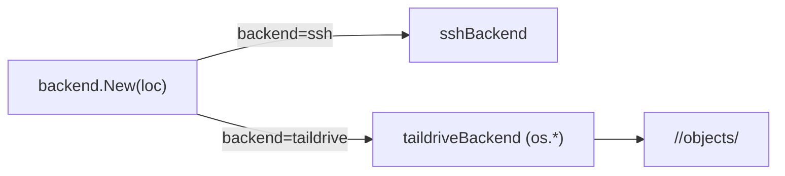

# Task 22: Taildrive backend — `os.*` over a mounted share

**Proposal:** [proposal.md](../proposal.md) · **Proposal Section:** Detailed Design → "Backend abstraction" (taildrive: *"operate on a locally-mounted share path with os.\* calls"*); "User-level registry — `locations.toml`" (office-nas taildrive example); Open Questions Q2/Q3; Risk Assessment (Taildrive flakiness → ship SSH first) · **Block:** 2 — Hardening & extras · **Estimated Effort:** 1 ideal eng-day · **Dependencies:** Task 09 (provides the `Backend` interface + the shared backend **contract test suite** this impl must pass), Task 10 (provides the `locations.toml` registry + the resolved `Location` struct that selects a backend) · **Type:** Implementation

## Summary

A second `Backend` implementation that targets a **locally-mounted Taildrive
share** instead of streaming over SSH. Because the share is a normal filesystem
path, every operation is a plain `os.*` call against
`<mount>/<subpath>/objects/<sha256>` (and `refs/`), using the **same on-node
layout** as the SSH backend. No network code, no `ssh` subprocess — Tailscale
mounts the share and we treat it as local disk.

Backend selection reads `backend = "ssh" | "taildrive"` (and, for taildrive,
`share`) from `locations.toml` and constructs the right implementation. The new
impl must satisfy the **same Backend contract tests** the SSH backend passes
(Task 09), so the engine (`push`/`pull`/`gc`/`verify`) is backend-agnostic.

Per the proposal this is intentionally shipped *after* SSH: *"Ship SSH backend
first; Taildrive opt-in"* (Q3 / Risk table — Taildrive/WebDAV flakiness at
~1 GB). This task adds the option without disturbing the SSH path.

## Context

### Related packages

- `internal/backend/taildrive.go` — **created here.** The `os.*` impl.
- `internal/backend/backend.go` (Task 09) — the `Backend` interface; unchanged.
- `internal/backend/select.go` (or wherever Task 09/10 wired construction) —
  **edited here** to add the `taildrive` arm of backend selection.
- `internal/backend/contract_test.go` (Task 09) — the **shared** contract test
  suite; this task runs it against a temp dir standing in for the mount.
- `internal/locations` (Task 10) — supplies `Location{Backend, Share, Node,
  BasePath, …}`; `Share` is consumed only by the taildrive arm.
- `internal/tserr` (Task 07) — map `os` errors to typed codes: a missing/
  unmounted share → `TV-NODE-01`/`TV-NODE-02`; missing blob → `TV-OBJ-01`.



### Prerequisites

- [ ] Task 09 merged: `Backend` interface + exported contract test runner.
- [ ] Task 10 merged: `locations.toml` parse exposes `Backend` + `Share`.
- [ ] Decide how the mount root is derived (see Notes): `base_path` is treated as
      the already-mounted local path for taildrive locations.

## Changes Required

### internal/backend/taildrive.go

- **File:** `internal/backend/taildrive.go`
- **Action:** create
- **Purpose:** implement `Backend` with `os.*` calls rooted at the mounted share
  path. The same `objects/<sha256>` key scheme as SSH — only the I/O differs.

```go
type taildriveBackend struct {
	root string // <base_path>/<subpath> — an already-mounted local path
}

func newTaildrive(loc locations.Location, subpath string) (*taildriveBackend, error) {
	root := filepath.Join(loc.BasePath, subpath)
	return &taildriveBackend{root: root}, nil
}

func (b *taildriveBackend) keyPath(key string) string { return filepath.Join(b.root, key) }

func (b *taildriveBackend) Stat(ctx context.Context, key string) (Meta, error) {
	fi, err := os.Stat(b.keyPath(key))
	if errors.Is(err, fs.ErrNotExist) {
		return Meta{}, ErrNotExist // contract sentinel — same as SSH
	}
	if err != nil {
		return Meta{}, tserr.Wrap(tserr.NodeUnreachable, err) // share unmounted?
	}
	return Meta{Size: fi.Size(), Exists: true}, nil
}

func (b *taildriveBackend) Get(ctx context.Context, key string, w io.Writer) error {
	f, err := os.Open(b.keyPath(key))
	if errors.Is(err, fs.ErrNotExist) {
		return tserr.New(tserr.ObjMissing, "blob %s missing on share", key) // TV-OBJ-01
	}
	// io.Copy(w, f) ...
}

func (b *taildriveBackend) Put(ctx context.Context, key string, r io.Reader) error {
	// content-addressed: Stat-skip if present; else write to a temp file in the
	// same dir and os.Rename into place (atomic on the same filesystem)
}

func (b *taildriveBackend) Delete(ctx context.Context, key string) error { /* os.Remove, ignore ErrNotExist */ }

func (b *taildriveBackend) List(ctx context.Context, prefix string) ([]string, error) {
	// filepath.WalkDir under <root>/<prefix>, return keys relative to root
}
```

Notes:

- **Atomic Put:** write to `objects/.tmp-<rand>` then `os.Rename` to
  `objects/<sha>`; create `objects/` with `os.MkdirAll` first. Rename within the
  same dir is atomic on a single filesystem and avoids a torn blob if the share
  hiccups mid-write (mitigates the documented flakiness risk).
- **Content-addressed skip:** mirror SSH — `Put` Stats first and returns early
  if the blob already exists (dedup; the contract test asserts this).
- **`ErrNotExist` sentinel:** the contract suite distinguishes "not found" from
  "backend error". Reuse the same exported sentinel the SSH backend returns so
  the engine treats both backends identically.
- Keys are forward-slash relative (`objects/<sha>`); convert with
  `filepath.FromSlash` when joining so it is correct cross-platform, but store
  list results as slash keys.

### internal/backend/select.go (backend selection)

- **File:** the constructor introduced in Task 09/10 (e.g. `internal/backend/select.go`)
- **Action:** edit
- **Purpose:** add the `taildrive` case so config drives which impl is built.

```go
func New(loc locations.Location, subpath string) (Backend, error) {
	switch loc.Backend {
	case "ssh", "":
		return newSSH(loc, subpath)
	case "taildrive":
		if loc.Share == "" {
			return nil, tserr.New(tserr.Config, "taildrive location %q missing `share`", loc.Name)
		}
		return newTaildrive(loc, subpath)
	default:
		return nil, tserr.New(tserr.Config, "unknown backend %q for location %q", loc.Backend, loc.Name)
	}
}
```

Key Considerations:

- No new networking — preflight for a taildrive location is "is the share path
  present and writable" (an `os.Stat` of `root` + a temp-write probe), surfaced
  as `TV-NODE-01` (absent/unmounted) or `TV-NODE-02` (not writable).
- The `share` field is informational for the registry; mounting Taildrive is
  out of scope (the user/OS mounts it). Document that `base_path` for a taildrive
  location is the **mounted** path.

## Implementation Checklist

- [ ] `taildriveBackend` implements all five `Backend` methods via `os.*`.
- [ ] `Put` is content-addressed (Stat-skip) and atomic (temp + rename).
- [ ] `Stat`/`Get` return the shared `ErrNotExist` / `TV-OBJ-01` correctly.
- [ ] `List` walks the share and returns slash-relative keys.
- [ ] Backend selection adds `taildrive` and validates `share` presence.
- [ ] Unmounted/unwritable share → `TV-NODE-01`/`TV-NODE-02`.

## Testing Requirements

- **Shared contract suite (primary deliverable):** run the Task 09 contract
  tests against a `t.TempDir()` standing in for the mounted share. The taildrive
  backend must pass the identical suite the SSH backend passes — Stat-miss,
  Put-then-Get round-trip, dedup (second Put of same key is a no-op/skip),
  Delete, List-prefix.

  ```go
  func TestTaildriveBackend_Contract(t *testing.T) {
      backend.RunContractTests(t, func(t *testing.T) backend.Backend {
          return newTaildrive(locations.Location{BasePath: t.TempDir()}, "")
      })
  }
  ```

- **Backend selection:**

  | `locations.toml` | Expect |
  |---|---|
  | `backend = "taildrive"`, `share = "vault"` | `New` returns a `*taildriveBackend` |
  | `backend = "taildrive"` with no `share` | `Config` error |
  | `backend = "ssh"` | `*sshBackend` (regression — unchanged) |
  | `backend = "wat"` | `Config` error |

- **Atomicity/dedup specifics:** second `Put` of an existing key performs no
  rename (assert via a wrapped writer call-count or mtime); a `Get` of an absent
  key yields `TV-OBJ-01`.

## Validation Checklist

- [ ] `go build ./...` succeeds.
- [ ] `go test ./...` passes (contract suite green for taildrive).
- [ ] `go vet ./...` clean.
- [ ] `gofmt -l .` reports nothing.
- [ ] Bump `VERSION` by `+0.0.1` and add a matching `## v<version>` entry to the
      top of `CHANGELOG.md` **in the same commit**.

## Acceptance Criteria

- The taildrive backend passes the **same** contract test suite as SSH.
- A `taildrive` location in `locations.toml` (with `share`) constructs the
  taildrive impl; an `ssh` location still constructs the SSH impl.
- Blobs land under `<base_path>/<subpath>/objects/<sha256>` — identical layout to
  SSH — so the same vault is readable by either backend.

## Related Proposal Sections

> `// taildrive: operate on a locally-mounted share path with os.* calls.`

> ```toml
> [locations.office-nas]
> node      = "100.92.14.7"
> base_path = "/vault"
> backend   = "taildrive"
> share     = "vault"
> ```

> **Risk Assessment:** Taildrive/WebDAV flakiness at ~1 GB … Ship SSH backend
> first; Taildrive opt-in (Open Q3).

## Notes & Considerations

- **Gotcha:** Taildrive renames across directories may not be atomic if the temp
  file isn't on the same filesystem — always create the temp in `objects/`
  itself.
- **Gotcha:** don't add Taildrive *mounting* logic; v1 assumes the OS mounts the
  share and `base_path` points at it.
- **For Next Task:** Task 23 (`verify`) streams + hashes blobs; for taildrive it
  reads the file directly rather than invoking remote `sha256sum`.
- **Prev:** [task-21-revert](./task-21-revert.md) ·
  **Next:** [task-23-verify](./task-23-verify.md)
