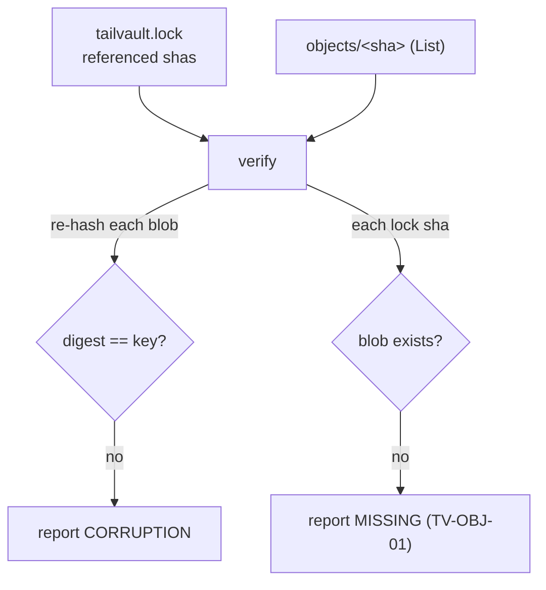

# Task 23: `tailvault verify` — re-hash stored blobs, report corruption/missing

**Proposal:** [proposal.md](../proposal.md) · **Proposal Section:** CLI surface (`tailvault verify` — *"re-hash stored blobs; report corruption/missing"*); Error model (`TV-OBJ-01`); Testing Strategy → Integration ("Integrity: corrupt a stored blob → `pull`/`verify` detects mismatch") · **Block:** 2 — Hardening & extras · **Estimated Effort:** 0.75 ideal eng-day · **Dependencies:** Task 09 (provides the `Backend` interface — `List`/`Get`/`Stat` — and, for SSH, the remote helper pattern used to run `sha256sum` on the node), Task 04 (provides `tailvault.lock` parse: the entries + `sha256`/`versions[]` to cross-check) · **Type:** Implementation

## Summary

`tailvault verify` audits the integrity of the stored vault against the
content-addressed invariant and the committed lock. It does two checks:

1. **Corruption** — for each blob under `objects/`, recompute its sha256 and
   confirm the digest equals its **content-addressed key**. A mismatch means the
   stored bytes have rotted/changed (the key is, by definition, the hash of the
   correct content).
2. **Missing** — for each `sha256` referenced by `tailvault.lock` (current
   entries plus history-on `versions[]`), confirm a blob actually exists on the
   node. A referenced sha with no blob is a dangling pointer.

Hashing strategy is backend-aware: for SSH, prefer a remote `sha256sum` over the
blob (avoids dragging ~1 GB across the tailnet); for taildrive (or as a
fallback) stream the blob through a local hasher. Missing blobs surface
`TV-OBJ-01`. `verify` is read-only — it never deletes or repairs.

## Context

### Related packages

- `cmd/tailvault/verify.go` — **created here.** Cobra command + report printing.
- `internal/verify` — **created here.** The audit logic, backend-agnostic.
- `internal/backend` (Tasks 09/22) — `List("objects/")`, `Get`/`Stat`; SSH impl
  exposes a remote-hash helper (`sha256sum`); taildrive streams + hashes.
- `internal/lock` (Task 04) — the set of referenced shas (current + `versions[]`).
- `internal/tserr` (Task 07) — `TV-OBJ-01` for missing blobs; bucketed exit code
  `5` (integrity) when any corruption/missing is found.



### Prerequisites

- [ ] Task 09 merged: `Backend.List`/`Get`/`Stat` + SSH remote-hash helper.
- [ ] Task 04 merged: lock parse exposing current `sha256` + history `versions[]`.

## Changes Required

### internal/backend — remote/stream hash helper

- **File:** `internal/backend/hash.go` (or methods on each backend)
- **Action:** create / extend
- **Purpose:** a `HashObject(ctx, key) (string, error)` that returns the sha256
  hex of the stored blob. SSH runs `sha256sum` on the node and parses the hex;
  taildrive (and the generic fallback) streams via `Get` into `sha256.New()`.

```go
// SSH: ssh user@node "sha256sum <base>/<subpath>/objects/<key>" -> first field.
// Taildrive/fallback: Get(key, sha256.New()) and return hex of the sum.
func HashObject(ctx context.Context, b Backend, key string) (string, error)
```

### internal/verify/verify.go

- **File:** `internal/verify/verify.go`
- **Action:** create
- **Purpose:** run both passes and return a structured `Report`.

```go
type Report struct {
	Checked   int       // blobs re-hashed
	Corrupt   []Finding // digest != key
	Missing   []Finding // lock sha with no blob
}

type Finding struct {
	Key      string // sha key (= expected hash)
	Got      string // computed hash (corruption only)
	Paths    []string // lock paths referencing this sha (for missing)
}

func Run(ctx context.Context, b backend.Backend, lk lock.Lock) (Report, error) {
	// 1. keys := b.List(ctx, "objects/")
	// 2. for each key: got := backend.HashObject(ctx, b, key)
	//        keyHash := strings.TrimPrefix(key, "objects/")
	//        if got != keyHash -> Corrupt
	// 3. referenced := lk.ReferencedSHAs()   // current + versions[]
	//    for each sha: if b.Stat("objects/"+sha) is ErrNotExist -> Missing
}
```

Notes:

- **Corruption is key-vs-digest**, independent of the lock: any stored blob whose
  bytes don't hash to its filename is corrupt, even if no lock references it.
- **Missing is lock-vs-store:** a lock sha (current or historical) with no blob.
- Report both classes; a blob can't be both. Print a concise summary
  (`checked N, corrupt M, missing K`) plus a line per finding; exit `0` only when
  both lists are empty, else `5`.
- Optional `--branch`/all-branches scoping can mirror GC's keep-set (Task 16) if
  cheap; not required — the lock on the current branch is the minimum.

### cmd/tailvault/verify.go

- **File:** `cmd/tailvault/verify.go`
- **Action:** create
- **Purpose:** wire the command; preflight node reachability (shared, Task 09);
  resolve backend + lock; print the report; map a non-empty report to exit `5`.

```go
&cobra.Command{
	Use:   "verify",
	Short: "Re-hash stored blobs; report corruption and missing objects",
	RunE: func(cmd *cobra.Command, _ []string) error {
		rep, err := verify.Run(cmd.Context(), be, lk)
		if err != nil { return err }
		printReport(rep)
		if len(rep.Corrupt) > 0 || len(rep.Missing) > 0 {
			return tserr.New(tserr.ObjMissing, "integrity check failed: %d corrupt, %d missing",
				len(rep.Corrupt), len(rep.Missing))
		}
		return nil
	},
}
```

Key Considerations:

- Preflight first — an offline node fails as `TV-NODE-01`, not as a flood of
  per-blob errors.
- For SSH, batch the remote hashing where possible (one `find … -exec sha256sum`
  or a piped loop) to avoid an `ssh` round-trip per blob across ~1 GB of objects.
- `verify` must never mutate the store (no Delete/Put) — it is purely diagnostic.

## Implementation Checklist

- [ ] `HashObject` helper: SSH `sha256sum` parse + taildrive/stream fallback.
- [ ] `verify.Run`: list objects, re-hash, compare digest to key → corruption.
- [ ] Cross-check lock shas (current + `versions[]`) → missing.
- [ ] `Report` with counts + per-finding detail.
- [ ] Command prints a concise summary and per-finding lines.
- [ ] Missing/corrupt → `TV-OBJ-01`, exit `5`; clean → exit `0`.
- [ ] Read-only: no store mutation.

## Testing Requirements

`internal/verify/verify_test.go` — reuse the **stub `Backend`** from Task 09
(in-memory `objects/<sha>` map; let the test write a blob whose bytes don't match
its key to simulate corruption).

| Case | Setup | Expect |
|---|---|---|
| Corruption detected | store a blob under key `K` but with bytes that hash to `X≠K` | `Corrupt` has one finding `{Key:K, Got:X}`; exit `5` |
| Missing detected | lock references sha `M` (current or in `versions[]`); no `objects/M` | `Missing` has one finding referencing `M`'s paths; `TV-OBJ-01`; exit `5` |
| All good | every lock sha present, every blob hashes to its key | empty report; exit `0` |
| Orphan blob, intact | blob present, hashes to its key, not in lock | not flagged (not corrupt, not missing) |
| History versions checked | history-on entry with `versions=[B,A]`, blob `A` absent | `A` reported missing |

Assert `HashObject` is exercised (the stub can compute sha of stored bytes so a
deliberately mis-keyed blob trips the corruption path).

## Validation Checklist

- [ ] `go build ./...` succeeds.
- [ ] `go test ./...` passes.
- [ ] `go vet ./...` clean.
- [ ] `gofmt -l .` reports nothing.
- [ ] Bump `VERSION` by `+0.0.1` and add a matching `## v<version>` entry to the
      top of `CHANGELOG.md` **in the same commit**.

## Acceptance Criteria

- A stored blob whose bytes no longer hash to its key is reported as corruption.
- A lock entry (current or historical `versions[]`) with no blob on the node is
  reported as missing and surfaces `TV-OBJ-01`.
- A fully intact vault verifies clean with exit `0`; any finding yields exit `5`.

## Related Proposal Sections

> **CLI surface:** `tailvault verify` — re-hash stored blobs; report corruption/
> missing.

> **Testing Strategy → Integration — Integrity:** corrupt a stored blob →
> `pull`/`verify` detects mismatch.

> `TV-OBJ-01 — Expected blob <sha> missing on the node.` (integrity/`pull`).

## Notes & Considerations

- **Gotcha:** corruption is judged against the *key*, not the lock — that's the
  whole point of content addressing; don't shortcut by trusting the filename.
- **Gotcha:** hashing every blob over SSH naively is one round-trip per object;
  batch it or you'll make `verify` painfully slow on the real ~1.1 GB vault.
- **For Next Task:** Task 24 (lock merge driver) keeps the lock canonical so the
  referenced-sha set `verify` reads is unambiguous after merges.
- **Prev:** [task-22-taildrive-backend](./task-22-taildrive-backend.md) ·
  **Next:** [task-24-lock-merge-driver](./task-24-lock-merge-driver.md)
