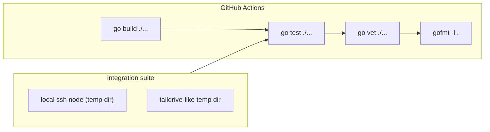

# Task 25: Integration suite, user docs, and CI

**Proposal:** [proposal.md](../proposal.md) · **Proposal Section:** entire "Testing Strategy" (Unit / Integration / Manual); "Distribution & Rollout" (build: `go build` → single static binary) · **Block:** 2 — Hardening & extras · **Type:** Testing · **Estimated Effort:** 2 ideal eng-days · **Dependencies:** Block 1 (esp. Task 09 backend/SSH for the stub + contract harness, Task 14 push, Task 15 pull, Task 16 GC) — and benefits from Tasks 20–24 if merged · the integration scenarios drive every command end-to-end

## Summary

The hardening cross-cut. Three deliverables:

1. **Integration suite** — exercises the engine end-to-end against a **local SSH
   "node"** (loopback `ssh` to a temp dir, or a stub-SSH harness) and a **temp
   Taildrive-like dir**, covering the proposal's Integration list: hard-fail,
   dedup, move/rename, delete + `auto_delete` + `preserve`, per-branch GC,
   history + revert, and integrity.
2. **User docs** — install, `init`/`setup`, `track`, day-to-day push/pull, and
   recovery/rollback, so a new user can adopt the tool without reading the source.
3. **CI workflow** — GitHub Actions running `go build`, `go test`, `go vet`, and
   `gofmt -l` on every push so `main` stays green.

The integration suite **is** the primary deliverable; CI being green proves it.

## Context

### Related packages

- `internal/integration/` (build-tagged) — **created here.** The end-to-end
  scenarios; uses the real commands via the engine, not mocks where avoidable.
- `internal/backend` (Tasks 09/22) — reuse the **stub `Backend`** + the contract
  test harness; add an SSH-to-localhost helper guarded by a build tag/env probe.
- `docs/` (or `README.md` sections) — **created/edited here.** User-facing docs.
- `.github/workflows/ci.yml` — **created here.** The CI pipeline.



### Prerequisites

- [ ] Block 1 merged: `init/track/status/push/pull/gc` work against a backend.
- [ ] Stub `Backend` (Task 09) available to reuse.
- [ ] Decide the SSH harness: real loopback `ssh` (skip when unavailable) vs a
      scripted fake-`ssh` on `PATH`. Make SSH-dependent tests `t.Skip` cleanly
      when no usable `ssh` is present so CI never flakes.

## Changes Required

### internal/integration/suite_test.go

- **File:** `internal/integration/*_test.go` (one file per scenario or grouped)
- **Action:** create
- **Purpose:** drive full flows. Each test spins a temp git repo + a temp vault
  dir (the "node"), runs `init`, `track`, `push`, etc., and asserts on the lock,
  the working tree, and the blobs on the node.

Cover the proposal's Integration list:

| Scenario | Steps | Assert |
|---|---|---|
| **Hard-fail** | point location at an unreachable node; `push` | exits non-zero (`3`/`4`); refs **not** advanced; no partial blobs; lock unchanged |
| **Dedup** | `push` an unchanged tree twice | second push performs **zero** `Put` calls |
| **Move/rename** | rename a tracked file (same content); `push` | zero transfer; lock key renamed, same `sha256` |
| **Delete + auto_delete** | delete a tracked file; `push`; `gc` | blob pruned; a `preserve` file's blob survives |
| **Per-branch GC** | branch B references blob X; delete X on branch A; `gc` | X **survives** (in B's keep-set) |
| **History + revert** | history-on file with ≥2 versions; `revert <path> <old>` | working bytes + lock `sha256` restored to old version |
| **Integrity** | corrupt a stored blob; `verify` (and `pull`) | mismatch detected; `TV-OBJ-01` for a missing blob |

```go
//go:build integration

func TestPush_HardFailWhenNodeDown(t *testing.T) {
	env := newRepoEnv(t)             // temp git repo + tailvault init
	env.setLocationUnreachable()
	code := env.run("push")
	require.NotEqual(t, 0, code)     // 3 or 4
	require.False(t, env.refsAdvanced())
	require.Empty(t, env.nodeObjects())
}
```

Notes:

- Gate the suite behind `//go:build integration` (or a `TAILVAULT_INTEGRATION`
  env) so unit runs stay fast; CI runs both. Document the invocation
  (`go test -tags integration ./...`).
- Reuse the stub `Backend` for backend-agnostic scenarios; use the taildrive
  temp-dir backend (Task 22) for the "temp Taildrive-like dir" half and the SSH
  helper for the "local SSH node" half so both transports are exercised.
- Each test is hermetic: `t.TempDir()` for repo + node, no shared global state,
  parallel-safe where possible.

### docs/usage.md (user docs)

- **File:** `docs/usage.md` (or expand `README.md`)
- **Action:** create
- **Purpose:** the adoption guide. Sections:
  - **Install** — `go build` / release binary; per-OS note (darwin/linux,
    amd64/arm64).
  - **`init` / `setup`** — register a location (interactive pick-list vs
    `--node`); what files land (`tailvault.toml`, `.gitattributes`, hooks).
  - **`track`** — adding globs; `min_size`; `history`/`preserve` overrides.
  - **Day-to-day** — how `git push`/`git pull` carry blobs; `status`; manual
    `push`/`pull`.
  - **Recovery / rollback** — `verify`, `revert`, and the full rollback (remove
    filter/hooks, restore real files → plain git).

### .github/workflows/ci.yml

- **File:** `.github/workflows/ci.yml`
- **Action:** create
- **Purpose:** green-on-push gate.

```yaml
name: ci
on: [push, pull_request]
jobs:
  build-test:
    runs-on: ubuntu-latest
    steps:
      - uses: actions/checkout@v4
      - uses: actions/setup-go@v5
        with: { go-version-file: go.mod }
      - run: go build ./...
      - run: go vet ./...
      - run: test -z "$(gofmt -l .)" || { gofmt -l .; exit 1; }
      - run: go test ./...
      - run: go test -tags integration ./...   # SSH-dependent tests self-skip
```

Key Considerations:

- `gofmt -l .` must **fail** CI when it lists files (the bare command exits 0
  even with output — hence the `test -z` guard).
- The integration job must not flake: SSH-dependent tests `t.Skip` when no `ssh`
  is usable on the runner; the taildrive-dir half always runs.

## Implementation Checklist

- [ ] Integration suite covers all seven proposal scenarios.
- [ ] Suite runs against both an SSH "node" and a taildrive-like temp dir.
- [ ] Suite is build-tagged and hermetic (`t.TempDir`, no shared state).
- [ ] User docs: install, `init`/`setup`, `track`, push/pull, recovery/rollback.
- [ ] CI workflow runs build, vet, gofmt-guard, test, and the integration tests.
- [ ] SSH-dependent tests skip cleanly when `ssh` is unavailable.

## Testing Requirements

The suite is itself the test deliverable. Additionally:

- A `go test ./...` (unit) run stays green and fast without the `integration`
  tag.
- A `go test -tags integration ./...` run passes locally (with `ssh` to
  localhost) and on CI (SSH tests skipping if needed, taildrive tests running).
- Each scenario asserts on **three** surfaces where relevant: the working tree
  bytes, `tailvault.lock`, and the blobs on the node — not just exit codes.

## Validation Checklist

- [ ] `go build ./...` succeeds.
- [ ] `go test ./...` passes; `go test -tags integration ./...` passes.
- [ ] `go vet ./...` clean.
- [ ] `gofmt -l .` reports nothing.
- [ ] CI workflow is green on the PR.
- [ ] Bump `VERSION` by `+0.0.1` and add a matching `## v<version>` entry to the
      top of `CHANGELOG.md` **in the same commit**.

## Acceptance Criteria

- Every scenario in the proposal's Testing → Integration list has a passing,
  hermetic test exercising the real commands.
- A new user can install, init, track, push/pull, and roll back using `docs`
  alone.
- CI runs build + vet + gofmt + unit + integration on push and is green on
  `main`.

## Related Proposal Sections

> **Testing Strategy → Integration (against a local SSH "node" and a temp
> Taildrive-like dir):** Hard-fail · Dedup · Move/rename · Delete + auto_delete ·
> Per-branch GC · History/revert · Integrity.

> **Distribution & Rollout — Build:** `go build` → single static binary; release
> per-OS (darwin/linux, amd64/arm64).

> **Rollback:** the tool is additive — pointers + lock are just files; removing
> the filter/hooks and restoring real files from the vault returns to plain git.

## Notes & Considerations

- **Gotcha:** the `gofmt -l .` step passes even on dirty files unless you guard
  it — keep the `test -z` wrapper.
- **Gotcha:** don't let integration tests depend on a developer's real tailnet;
  the "node" is always a temp dir / loopback.
- **For Next Task:** Task 26 (dogfood) runs the *manual* acceptance against a
  real Pi; this task gives it the automated safety net underneath.
- **Prev:** [task-24-lock-merge-driver](./task-24-lock-merge-driver.md) ·
  **Next:** [task-26-dogfood-root-pnp](./task-26-dogfood-root-pnp.md)
