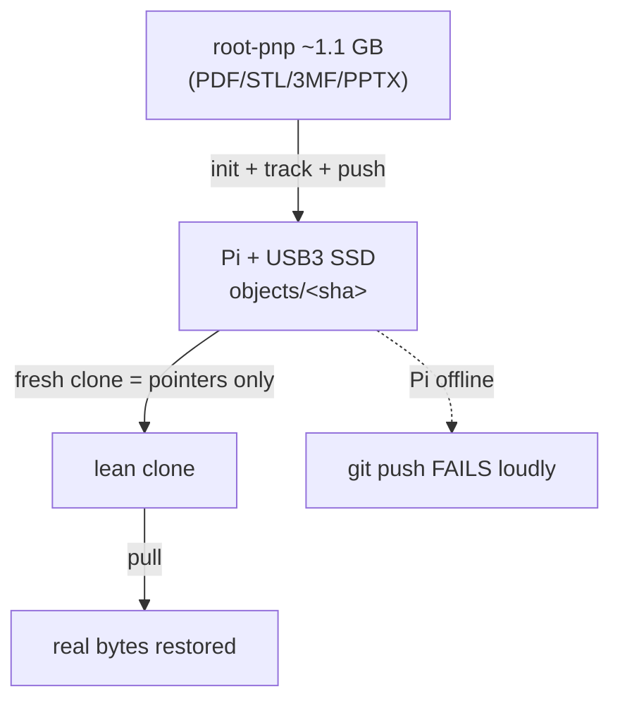

# Task 26: Dogfood on `root-pnp` — real acceptance run

**Proposal:** [proposal.md](../proposal.md) · **Proposal Section:** Implementation Plan → Phase 9 ("Dogfood on root-pnp"); Testing Strategy → Manual / acceptance; Distribution & Rollout (phased adoption + rollback); Executive Summary (the 1.1 GB driver) · **Block:** 3 — Dogfood · **Type:** Acceptance · **Estimated Effort:** 1 ideal eng-day · **Dependencies:** Block 1 (full MVP: `init/track/status/push/pull/gc` over the SSH backend) + ideally Task 23 (`verify`, to confirm integrity post-migration) and Task 24 (lock merge driver, for multi-branch safety)

## Summary

The real-world acceptance run: migrate `root-pnp`'s ~1.1 GB of print-and-play
PDFs/STLs/3MF/PPTX behind a branch onto a **real Tailscale node** (Raspberry Pi
+ USB3 SSD), and prove the end-to-end guarantees the whole project exists for:

- a **fresh clone is lean** (pointers only, not 1.1 GB);
- `pull` restores the **real bytes**;
- edit/delete cycles + `gc` actually **reclaim space** on the node;
- `git push` **fails loudly when the Pi is offline** (the core hard-fail
  guarantee).

This is mostly a **manual/acceptance checklist** (scripted where possible). The
deliverable is a documented, repeatable migration runbook **and** its rollback —
not new product code. Per the proposal: *"start read-mostly on `root-pnp` behind
a branch; verify lean clone + reliable push/pull before flipping other
projects,"* and rollback is *"removing the filter/hooks and restoring real files
from the vault returns to plain git."*

## Context

### Related packages

- No new packages. This task **uses** the shipped binary end-to-end.
- `docs/dogfood-root-pnp.md` — **created here.** The migration runbook +
  rollback, with the acceptance checklist and any helper scripts.
- `scripts/` (optional) — **created here.** Small helper scripts to script the
  scriptable steps (clone-size check, edit/delete loop, offline-push probe).

### Prerequisites

- [ ] A real Pi (or equivalent) on the tailnet with a **USB3 SSD** mounted (not
      the boot SD), Tailscale up, SSH backend reachable.
- [ ] The laptop is logged into the same tailnet (`tailscale status` healthy).
- [ ] Block 1 binary installed; `verify` (Task 23) available if asserting
      integrity.
- [ ] Work **behind a branch** in `root-pnp` — never directly on its main line
      until acceptance passes.

## Changes Required

### docs/dogfood-root-pnp.md — migration runbook

- **File:** `docs/dogfood-root-pnp.md`
- **Action:** create
- **Purpose:** the exact, repeatable steps to migrate, verify, and roll back.

Migration steps (document each with the command + expected output):

1. `tailvault location add home-pi --node <magicdns>` (or interactive `setup`) →
   write `locations.toml`; confirm `tailvault location ls` shows it reachable.
2. On a branch in `root-pnp`: `tailvault init` → writes `tailvault.toml`,
   `.gitattributes`, installs hooks (and registers the lock merge driver if
   Task 24 is in).
3. `tailvault track '**/*.pdf' '**/*.stl' '**/*.3mf' '**/*.pptx'` → include rules
   land in `tailvault.toml` (the exact globs from the proposal).
4. `tailvault status` → shows the large files as local-only / to-be-pushed.
5. `tailvault push` (or `git push` via the pre-push hook) → blobs land in
   `objects/<sha>` on the Pi; lock updated with pusher stamp.
6. `tailvault verify` → no corruption/missing (integrity baseline).

### Acceptance checklist (the proof)

- [ ] **Lean clone:** `git clone` the repo fresh into a temp dir → the clone is
      **MB, not ~1.1 GB**; tracked files are pointer text, not real bytes.
      (Script: clone, `du -sh`, assert under a threshold.)
- [ ] **Pull restores bytes:** in the fresh clone, `tailvault pull` (or checkout
      via smudge) → the large files are byte-identical to the originals
      (`sha256sum` compare a sample).
- [ ] **Edit/delete cycles + GC reclaim space:** edit a PDF, push; delete an STL,
      push; run `tailvault gc --dry-run` then `gc` → node `objects/` disk usage
      **drops** by the expected amount; `preserve`d files are untouched.
- [ ] **Offline hard-fail:** power off / disconnect the Pi → `git push` (and
      `tailvault push`) **fail loudly** with `TV-NODE-01` and a non-zero exit;
      refs are **not** advanced; no partial upload. (Script: probe with the Pi
      down, assert non-zero exit + unchanged remote ref.)

### Rollback runbook (also in the doc)

- [ ] Remove the git filter + hooks (`git config --unset` the clean/smudge
      filter; delete the installed hook files) and drop the `.gitattributes`
      entries.
- [ ] Restore real files into the working tree from the vault (`tailvault pull`
      to materialize, then commit the real bytes) so the repo is plain git again.
- [ ] Confirm `git status` is clean and the files are real bytes, not pointers —
      the repo behaves exactly as before tailvault, just heavier.
- [ ] Note that this is non-destructive: pointers + lock were just files.

Key Considerations:

- **Branch isolation:** all of this happens behind a branch; only flip
  `root-pnp`'s main line after the checklist passes.
- **Record real numbers:** clone size before/after, push time/GB on the Pi
  (proposal expects "few min/GB" — Pi crypto throughput), `objects/` size before/
  after GC. These numbers are the acceptance evidence.
- **Don't lose data:** keep a full backup of `root-pnp` until the lean clone +
  pull round-trip is verified byte-identical.

## Implementation Checklist

- [ ] Runbook documents every migration command + expected output.
- [ ] Acceptance checklist run on a **real** Pi over Tailscale, results recorded.
- [ ] Lean-clone, pull-restores-bytes, GC-reclaims, offline-hard-fail all pass.
- [ ] Rollback runbook documented and dry-run verified.
- [ ] Helper scripts (clone-size, edit/delete loop, offline probe) committed.

## Testing Requirements

This is an **acceptance** task; the "tests" are the manual checklist above,
scripted where feasible:

- **Lean-clone script:** fresh `git clone` → `du -sh` → assert `< ~50 MB` (well
  under the original 1.1 GB); assert a sampled tracked file is a pointer.
- **Round-trip script:** `pull` in the fresh clone → `sha256sum` a sample set →
  compare to originals; all match.
- **GC script:** snapshot Pi `objects/` size → edit+delete+push → `gc` → snapshot
  again → assert size dropped; assert a `preserve`d blob still present.
- **Offline-push probe:** with the Pi unreachable, run `git push` → assert
  non-zero exit, `TV-NODE-01` in stderr, remote ref unchanged.

(Where a real Pi isn't available in CI, these scripts run manually and their
output is pasted into the runbook as evidence; the automated equivalents live in
Task 25's integration suite against a temp "node".)

## Validation Checklist

- [ ] `go build ./...` succeeds (binary used for the run is current).
- [ ] `go test ./...` passes.
- [ ] `go vet ./...` clean.
- [ ] `gofmt -l .` reports nothing.
- [ ] Bump `VERSION` by `+0.0.1` and add a matching `## v<version>` entry to the
      top of `CHANGELOG.md` **in the same commit**.

## Acceptance Criteria

- A fresh clone of migrated `root-pnp` is **lean** (pointers only, orders of
  magnitude smaller than 1.1 GB) and `pull` restores byte-identical files.
- Edit/delete cycles followed by `gc` measurably reclaim space on the Pi;
  `preserve`d files survive.
- With the Pi offline, `git push` **fails loudly** (`TV-NODE-01`, non-zero exit)
  and never advances refs.
- The rollback runbook returns the repo to plain git with real files and a clean
  `git status`.

## Related Proposal Sections

> **Phase 9 — Dogfood on root-pnp.** Migrate `root-pnp`'s blobs into a real
> location; verify lean clone + push.

> **Testing Strategy → Manual / acceptance.** End-to-end on a real Pi over
> Tailscale with a USB3 SSD. Dogfood: `root-pnp` clone is lean; `git push` lands
> blobs and fails when the Pi is offline.

> **Distribution & Rollout — Phased adoption / Rollback.** Start read-mostly on
> `root-pnp` behind a branch … removing the filter/hooks and restoring real files
> from the vault returns to plain git.

## Notes & Considerations

- **Gotcha:** verify the lean-clone + pull round-trip is byte-identical **before**
  you trust the vault as the only copy — keep a backup until then.
- **Gotcha:** Pi crypto throughput caps transfer speed; record the few-min/GB
  expectation so a "slow" push isn't mistaken for a failure.
- **For Next Task:** none — this closes the v1 plan. Success here is the signal to
  flip other projects off git-resident blobs.
- **Prev:** [task-25-tests-docs-ci](./task-25-tests-docs-ci.md) · **Next:** —
  (end of plan)
