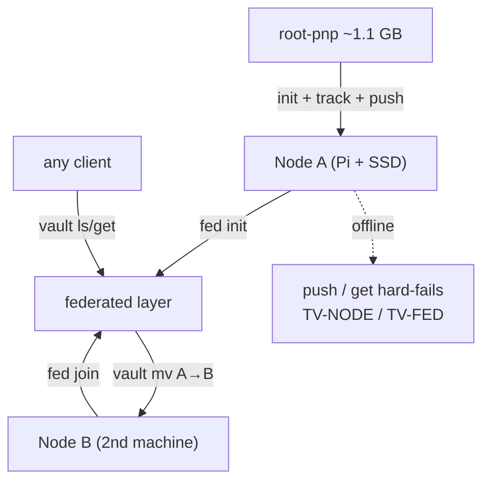

# Task 26: Dogfood — `root-pnp` migration + federation acceptance on real nodes

**Proposal:** [proposal.md](../proposal.md) · **Proposal Section:** Implementation Plan → Phase 9 ("Dogfood on root-pnp", absorbed into Block 6) + Part II task breakdown → Block 6; Testing Strategy → Manual / acceptance · **Block:** 7 — Dogfood (final block; the real use case closes the plan) · **Type:** Acceptance · **Estimated Effort:** 2–3 ideal eng-days (plus hardware setup) · **Dependencies:** Blocks 1–6 complete and Tasks 57–59 (config matrix, route walkthroughs, failure drills — all green on the local mock rig first). Requires **2+ real tailnet nodes** (e.g. Pi + USB3 SSD, plus a second machine/disk).

## Summary

The real-world acceptance run, grown from the original single-Pi scope to cover
the **federation**. Two proofs in one task:

1. **The v1 promise** (unchanged): migrate `root-pnp`'s ~1.1 GB of
   print-and-play PDFs/STLs/3MF/PPTX onto a real Tailscale node behind a
   branch, and prove a fresh clone is lean, `pull` restores real bytes,
   edit/delete + `gc` reclaim space, and `git push` **fails loudly when the
   node is offline**.
2. **The v2 promise**: with a second real node, walk the full federation
   lifecycle — `fed init` → `fed join` → `vault put` → `vault ls/get` from a
   third machine → `vault mv` between nodes → pull-resolves-the-move +
   `heal` → `fed leave` detach warnings — plus live security checks
   (password-gated mutations, WAL chain verify on real disks).

This is a **guided manual/acceptance checklist**: the maintainer runs the
hardware steps with the runbook open; everything scriptable is scripted by
dev/QA beforehand (the automated equivalents already live in Tasks 39/50 —
this task re-runs the critical ones against real hardware). The deliverable
is `docs/dogfood-root-pnp.md` (migration + federation runbook + rollback) and
recorded acceptance evidence. **Append every surprise to `EDGE-CASES.md`** —
Block 7 (Task 56) consumes that log.

## Context

### Related packages

- No new product code. This task **uses** the shipped binary end-to-end.
- `docs/dogfood-root-pnp.md` — **created here.** Migration + federation
  runbook, rollback, acceptance evidence.
- `scripts/` (optional) — helper scripts: clone-size check, edit/delete loop,
  offline-push probe, federation walkthrough probes.
- `EDGE-CASES.md` — **appended here** (created in Task 27).

### Prerequisites

- [ ] Two+ real nodes on the tailnet (Node A: Pi + USB3 SSD; Node B: any
      machine with spare disk), Tailscale up, SSH reachable on both.
- [ ] Blocks 1–5 binaries current; `go build ./...` from main.
- [ ] Vault passwords set on both nodes (`vault passwd`, Task 46).
- [ ] Work **behind a branch** in `root-pnp` until acceptance passes; keep a
      full backup until the round-trip is verified byte-identical.

## Changes Required

### docs/dogfood-root-pnp.md — runbook (migration + federation + rollback)

- **File:** `docs/dogfood-root-pnp.md`
- **Action:** create
- **Purpose:** exact, repeatable steps with commands + expected output.

**Part A — v1 migration (as originally specced):**

1. `tailvault location add home-pi` → `location ls` shows reachable.
2. On a branch: `tailvault init`; `track '**/*.pdf' '**/*.stl' '**/*.3mf'
   '**/*.pptx'`; `status`; `push`; `verify` (now 3-way, Task 38).
3. Acceptance: lean fresh clone (MB not GB, pointers only); `pull` restores
   byte-identical files (`sha256sum` sample); edit/delete + `gc --dry-run`
   then `gc` reclaims node disk, `preserve`d files untouched; with Node A
   offline `git push` fails loudly (`TV-NODE-01`, non-zero exit, refs not
   advanced).

**Part B — federation walkthrough (new):**

1. `fed init` on Node A's location → `fed status` shows roster of 1.
2. `vault init` on a manual storage root on Node A (`.tailvaultignore`
   honored; deselect flag exercised once).
3. `fed join` Node B → `fed status` shows 2 members, both reachable.
4. From a third client with **no repo checkout**: `vault ls` (logical tree +
   IDs + reachability), `vault put` a file (conflict prompt exercised once,
   `--on-conflict` once), `vault get` (receipt written to
   `~/.tailvault/receipts/`).
5. `vault mv` a file Node A → Node B (password prompted; WAL intents on both
   ends). Then in a repo referencing it: `pull` WARNS about the move; `heal`
   rewrites the lock; commit.
6. Down-member drills: take Node B offline → `vault ls` shows last-seen from
   cache + partial-view metadata; `vault get` of a B-homed file hard-fails
   `TV-FED` (not `TV-OBJ`); `ops` shows any pending op; bring B back,
   `ops retry` clears it.
7. Security spot-checks: a mutating op without the password is **rejected**;
   `wal verify` (Task 53) passes on both nodes' real chains.
8. `fed leave` Node B → referencing repos warn ("repush or resync"); Node B's
   disk untouched; `fed status` roster back to 1.

**Part C — rollback** (unchanged from v1): remove filter + hooks, drop
`.gitattributes` entries, `pull` to materialize real bytes, commit; repo is
plain git again, `git status` clean. Non-destructive by construction.

Key Considerations:

- **Record real numbers:** clone size before/after, push min/GB on the Pi,
  `objects/` size before/after gc, `vault mv` throughput node-to-node.
  These numbers are the acceptance evidence — paste into the runbook.
- **Guided, not faked:** hardware steps are run by the maintainer with the
  runbook; never simulate them and report success.
- **EDGE-CASES.md:** every wrinkle (clock skew, slow SSH, prompt UX, cache
  staleness…) gets a dated entry.

## Implementation Checklist

- [ ] Runbook documents every command + expected output for Parts A–C.
- [ ] Part A acceptance run on real hardware; all four v1 proofs pass.
- [ ] Part B federation walkthrough run on 2 real nodes + third client; all
      eight steps pass, including both down-member drills.
- [ ] Security spot-checks pass (auth rejection, wal verify).
- [ ] Rollback dry-run verified.
- [ ] Evidence (numbers, command output) recorded in the runbook.
- [ ] EDGE-CASES.md appended with everything observed.

## Testing Requirements

Acceptance task — the checklist above IS the test, scripted where feasible:

- **Lean-clone / round-trip / GC / offline-probe scripts** (as v1).
- **Federation probes:** `fed status` JSON-parse assert (2 members → 1);
  `vault get` receipt file exists + genesis hash check; mv → pull-warn →
  heal → clean status loop; partial-view probe asserts `TV-FED` exit code
  (6) vs `TV-OBJ` (5) with Node B down.
- Automated equivalents already run in CI via Tasks 39/50; this task's value
  is the **real hardware + real tailnet** run.

## Validation Checklist

- [ ] `go build ./...` succeeds (binary used is current main).
- [ ] `go test ./...` passes.
- [ ] `go vet ./...` clean.
- [ ] `gofmt -l .` reports nothing.
- [ ] Bump `VERSION` by `+0.0.1` and add a matching `## v<version>` entry to the
      top of `CHANGELOG.md` **in the same commit**.

## Acceptance Criteria

- All v1 proofs hold on real hardware (lean clone; byte-identical pull; gc
  reclaim with `preserve` honored; loud offline hard-fail, refs unmoved).
- Full federation lifecycle (init/join/put/ls/get/mv/heal/leave) succeeds on
  2 real nodes from a checkout-free client, with password gating enforced.
- Down-member behavior matches spec: cache-backed last-seen views, `TV-FED`
  partial-view hard-fail, pending ops retried cleanly.
- Rollback returns the repo to plain git.
- Runbook + evidence committed; EDGE-CASES.md updated.

## Related Proposal Sections

> **Block 6 — Dogfood (grown scope; absorbs Phase 9).** 2+ real nodes; migrate
> `root-pnp`; federation walkthrough (init/join/put/mv/leave); live security
> checks; per-command guided acceptance; automated demo-project tests by dev/QA.

> **Part II → Resolution & reachability.** …not found among reachable with ≥1
> member unreachable → TV-FED partial-view hard-fail ("cannot prove absence")…

> **Distribution & Rollout — Rollback.** Removing the filter/hooks and
> restoring real files from the vault returns to plain git.

## Notes & Considerations

- **Gotcha:** verify the lean-clone + pull round-trip byte-identical **before**
  trusting the vault as the only copy.
- **Gotcha:** Pi crypto throughput caps speed (few min/GB) — slow ≠ failed.
- **Gotcha:** the down-member drills mutate real WALs; run `ops` + `wal verify`
  after each drill so a stuck intent isn't carried into the next step.
- **For Next Task:** none — this is the final task of the plan. Late
  EDGE-CASES.md entries from this run feed a future edge-case iteration.
- **Prev:** [task-59-dogfood-failure-recovery-drills](./task-59-dogfood-failure-recovery-drills.md) ·
  **Next:** — (end of plan)
